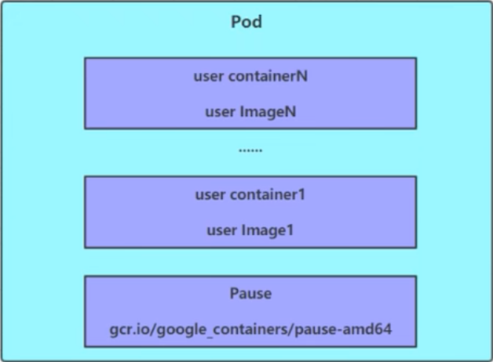
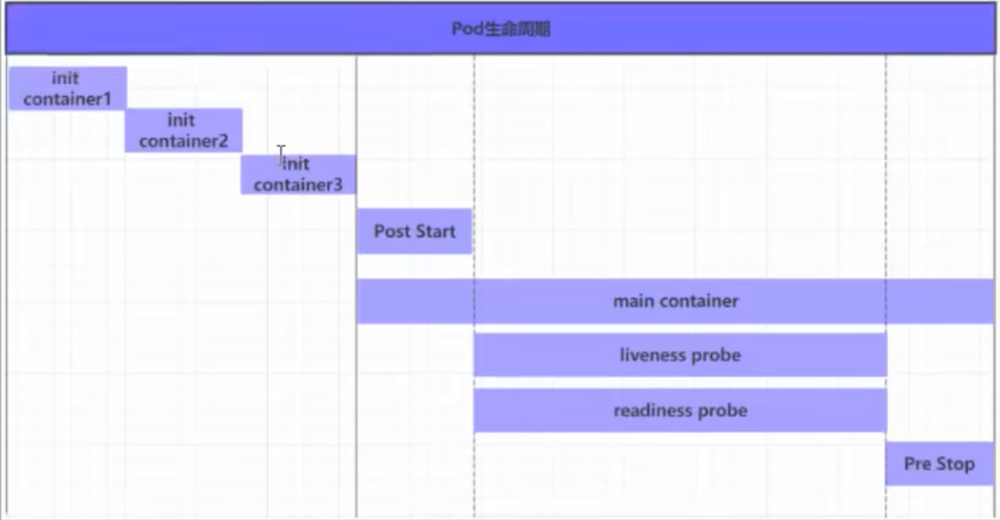

# Pod 详解

## pod 介绍
### pod 结构


每个 pod 中可以有一个或多个容器，这些容器可以分为两类：
- 用户程序所在的容器，数量可多可少
- Pause 容器，每个 pod 中必须有的 根容器，他的作用有两个：
  - 可以以他为依据，评估 pod 的健康状态
  - 可以在根容器上设置 ip，其他容器共享根容器的 ip，以此来实现 pod 内的网络共享（这里是 pod 内，pod 间的通信使用的虚拟二层网络，例如flannel）


### pod 定义
下面是 pod 的资源清单：
```yaml
apiVersion: v1      # 必选 版本
kind: Pod           # 必选 资源类型
metadata:          # 必选 元数据
  name: nginx-pod   # 必选 pod名称
  namespace: default   # 命名空间 默认 default
  labels:             # 标签    
    app: nginx
spec:               # 必选 pod 配置
  containers:       # 必选 容器列表
    - name: nginx    # 必选 容器名称
      image: nginx:1.25.0   # 必选 镜像
      imagePullPolicy: IfNotPresent # 镜像拉取策略 Always 总是拉取 Always 总是拉取 Never 从不拉取 IfNotPresent 如果本地有镜像，则使用本地镜像，否则拉取镜像
      command: ["/bin/sh", "-c", "echo 'Hello, World!' && sleep 3600"] # 容器启动命令
      args: ["-c", "echo 'Hello, World!' && sleep 3600"] # 容器启动参数
      workingDir: /app # 容器工作目录
      volumeMounts: # 挂载到容器内部的存储卷位置
        - name: nginx-volume # 存储卷名称
          mountPath: /usr/share/nginx/html # 挂载路径
          readOnly: true # 是否只读
      ports:
        - name: nginx-port # 端口名称
          containerPort: 80 # 容器端口
          hostPort: 80 # 主机端口
          protocol: TCP # 协议
          hostIP: 127.0.0.1 # 主机ip
      env: # 环境变量
        - name: NGINX_PORT # 环境变量名称
          value: "80" # 环境变量值
      resources: # 资源请求
        requests: # 资源请求
          cpu: 100m # cpu 请求
          memory: 128Mi # 内存请求
        limits: # 资源限制
          cpu: 200m # cpu 限制
          memory: 256Mi # 内存限制
```

配置非常多，可以按层级进行配置，例如：
```bash
# 获取资源的可配置项
# kubectl explain 资源类型.属性
kubectl explain pod

kubectl explain pod.spec.containers
```

由命令可知，一级属性有：
- apiVersion
  - 版本
- kind
  - 资源类型
- metadata
  - 元数据
- spec
  - 配置


spec 是重点，里面可以配置的属性非常多，例如：
- containers
  - 容器列表
- nodeName
  - 指定 pod 运行在哪个节点上
- nodeSelector
  - 指定 pod 运行在哪个节点上
- hostNetwork
  - 是否使用主机网络
- volumes
  - 存储卷列表
- restartPolicy
  - 重启策略

## pod 配置
本节探讨 `pod.spec.containers` 的配置
改属性主要有以下配置项：
- name
  - 容器名称
- image
  - 镜像
- imagePullPolicy
  - 镜像拉取策略
- command
  - 容器启动命令
- args
  - 容器启动参数
- env
  - 环境变量
- resources
  - 资源请求
- ports
  - 端口
- volumeMounts
  - 挂载到容器内部的存储卷位置


### 基本配置
```yaml
apiVersion: v1
kind: Pod
metadata:
  name: pod-base
spec:
  containers:
    - name: nginx
      image: nginx:1.25.0
    - name: busybox
      image: busybox:1.36.0
```

上面配置了一个简单pod，里没有两个容器

### 启动命令
刚才的 pod busybox 一直起不来，是因为 busybox 没有启动命令，所以一直处于重启状态，下面配置 busybox 的启动命令：
```yaml
apiVersion: v1
kind: Pod
metadata:
  name: pod-base
spec:
  containers:
    - name: busybox
      image: busybox:1.36.0
      command: ["/bin/sh", "-c", "echo 'Hello, World!' && sleep 3600"]
```
command 用来指定容器启动命令


### port
```yaml
apiVersion: v1
kind: Pod
metadata:
  name: pod-base
spec:
  containers:
    - name: busybox
      image: busybox:1.36.0
      ports:
        - name: busybox-port  # 端口名称,如果指定，必须保证在 pod 中是唯一的
          containerPort: 80  # 容器端口
          hostPort: 80  # 主机端口，如果指定，pod 只能有一个副本，一般省略
          hostIP: 127.0.0.1  # 主机ip 一般省略  
          protocol: TCP  # 协议 一般省略
```

### 资源配额
k8s 提供了 对 cpu 和 内存 的配额管理，可以限制容器使用资源的上限，防止资源滥用。
```yaml
apiVersion: v1
kind: Pod
metadata:
  name: pod-base
spec:
  containers:
    - name: busybox
      image: busybox:1.36.0
      resources:
        requests: # 资源最低配额
          cpu: 2 # cpu 请求  核心数
          memory: 256Mi # 内存请求
        limits: # 资源最高配额
          cpu: 2 # cpu 限制  核心数
          memory: 256Mi # 内存限制
```


## pod 生命周期

创建至终止：
- pod 创建
- init container 初始化容器
- main container 主容器
  - 容器启动后钩子 post start，终止前钩子 pre stop
  - 容器存活性探测 livenessProbe，就绪性探测 readinessProbe
- pod 运行
- pod 终止



在整个生命周期中，pod 有以下状态：
- 挂起 pending：apiserver 已经创建 pod 资源对象，但他尚未被调度完成或仍处于下载镜像的过程中
- 运行 running：pod 已经被调度至某节点，并且所有容器都已经被 kubectl 创建完成
- 成功 succeeded：所有容器都已成功运行，并且不会被重启
- 失败 failed：所有容器都已失败，并且不会被重启
- 未知 unknown：apiserver 无法获取 pod 状态，通常是由于 apiserver 与 kubelet 之间的通信问题


### 创建和终止
pod 的创建过程
1. 用户通过 kubectl 或其他客户端提交需要创建的 pod 资源清单给 apiserver
2. apiserver 开始生成 pod 对象信息，并将信息存入 etcd 中，然后返回确认信息至客户端
3. apiserver 开始反映 etcd 中的 pod 对象信息的变化，其他组件使用 watch 机制监听这些变化，并采取相应的操作
4. scheduler 发现有新的 pod 需要创建，开始为 pod 分配节点，并将结果更新至 api server
5. node 节点发现有 pod 调度过来，尝试调用 docker 启动容器，并将结果更新至 api server
6. api server 将 pod 状态信息更新至 etcd 中，完成 pod 创建过程


pod 的终止过程
1. 用户通过 kubectl 或其他客户端提交需要终止的 pod 资源清单给 apiserver
   1. apiServer 中的 pod 对象信息将随时间变化，在宽限期内（默认30s），pod 将视为 dead
2. 将 pod 标记为 terminating
3. kubectl 在监听到 pod 转为 terminating 状态后，开始删除 pod 资源对象
4. 端点控制器监听到 pod 对象的关闭行为时将其从所有匹配的端点的 service 资源的端点列表中移除
5. 如果当前 pod 定义了 preStop 钩子，则执行 preStop 钩子
6. pod 对象中的容器收到停止信号
7. 宽限期结束后，若 pod 中还存在运行的进程，那么 pod 对象将收到立即终止的信号
8. kubectl 请求 apiserver 将此 pod 资源的宽限期设置为 0 从而完成删除操作，此时 pod 对于用户已不可见


### 初始化容器
初始化容器是 pod 的主容器启动后需要运行的容器，主要做一些前置工作，他们具有两种典型特征：
1. 初始化容器必须运行完成至结束，若初始化容器运行失败，那么 k8s 会重启主容器，直到初始化容器成功为止
2. 初始化容器必须按照定义的顺序依次运行，当且仅当前面一个成功后，后面的才会执行

初始化容器有以下应用场景：
- 提供主容器中不具备的工具程序或自定义代码
- 初始化容器需要先于应用容器串行启动并运行完成，因此可用于延后主容器的执行，直至其依赖得到满足 

示例：
主容器启动 nginx，但依赖 mysql 和 redis，假定两个 ip 为对应服务器的 ip
创建配置文件：
```yaml
apiVersion: v1
kind: Pod
metadata:
  name: pod-init-container
spec:
  containers:
    - name: nginx
      image: nginx:1.25.0
      ports:
        - name: nginx-port
          containerPort: 80
  initContainers:
    - name: mysql
      image: busybox:1.36.0
      command: ["/bin/sh", "-c", "util ping 192.168.1.1 && sleep 3600"]
    - name: redis
      image: busybox:1.36.0
      command: ["/bin/sh", "-c", "util ping 192.168.1.2 && sleep 3600"]
```
```bash
# 创建 pod
kubectl apply -f pod-init-container.yaml

# 查看 pod 状态
# 发现 pod 卡在第一个容器启动状态，后面的容器不会启动
kubectl get pod pod-init-container -o wide

# 更改机器ip，加上两个服务的ip后，pod 启动完成
ifconfig ens33:1 192.168.1.1 netmask 255.255.255.0 up
ifconfig ens33:2 192.168.1.2 netmask 255.255.255.0 up
```

### 钩子函数
主容器中有两个 钩子函数位子：
- post start
  - 容器启动后钩子，执行失败，主容器会重启
- pre stop
  - 容器终止前钩子，执行时阻塞容器的删除

钩子函数支持使用3种方式定义：
- exec：在容器内执行一次命令
  ```yaml
  lifecycle:
    postStart:
      exec:
        command: ["/bin/sh", "-c", "echo 'Hello, World!' && sleep 3600"]
  ```
- TCPSocket：尝试与指定端口建立TCP连接
  ```yaml
  lifecycle:
    postStart:
      tcpSocket:
        port: 80
        host: 127.0.0.1
  ```
- HTTPGet：尝试与指定端口建立HTTP连接
  ```yaml
  lifecycle:
    postStart:
      httpGet:
        path: /start
        port: 80
        host: 127.0.0.1
        scheme: HTTP
  ```

### 容器探测
容器探测用于检测当前容器是否正常工作
- livenessProbe：存活性探测，用于检测容器是否正常工作  如果不是，则重启容器
- readinessProbe：就绪性探测，用于检测容器是否可以接收请求  如果不是，则从 service 的端点列表中移除，不会转发流量

3种配置方式：
- exec：在容器内执行一次命令
  ```yaml
  livenessProbe:
    exec:
      command: ["/bin/sh", "-c", "util ping 192.168.1.1 && sleep 3600"]
  readinessProbe:
    exec:
      command: ["/bin/sh", "-c", "util ping 192.168.1.1 && sleep 3600"]
  ```
- TCPSocket：尝试与指定端口建立TCP连接
  ```yaml
  livenessProbe:
    tcpSocket:
      port: 80
      host: 127.0.0.1
  readinessProbe:
    tcpSocket:
      port: 80
      host: 127.0.0.1
  ```
- HTTPGet：尝试与指定端口建立HTTP连接
  ```yaml
  livenessProbe:
    httpGet:
      path: /
      port: 80
      host: 127.0.0.1
      scheme: HTTP
  readinessProbe:
    httpGet:
      path: /
      port: 80
      host: 127.0.0.1
      scheme: HTTP
  ```

### 重启策略
pod 重启有3种策略
- Always：当容器失联时，重启容器，默认值
- OnFailure：当容器退出且返回不为0时，重启容器
- Never：任何状态，都不重启容器

重启策略适用于 pod 中的所有容器
首次需要重启的容器，会立即重启，随后的重启会由 k8s 延迟一段时间后运行，延时为 10s、20s、40s、80s、160s、300s 300为最大延时


## pod 调度
在默认情况下，一个pod  在哪个 node 运行，是由 scheduler 组件根据算法算出来的，这个过程不受人工干预，但有时候需要指定特定的调度方式
k8s 提供了4大类调度方式：
- 自动调度：由 scheduler 组件根据算法算出来的，这个过程不受人工干预
- 定向调度：NodeName、NodeSelector
- 亲和性调度：NodeAffinity、PodAffinity、PodAntiAffinity
- 污点与容忍：Taints、Toleration

### 定向调度
在 pod 上声明 nodeName 或 nodeSelector 属性，指定 pod 运行在哪个 node 上，这个指定是强制的，即使 node 不存在也会调度，只不过结果是失败

NodeName: 直接指定 node 名称

NodeSelector: 指定 label 标签
需要先为 node 配置 label 标签
```bash
# 为 node 配置 label 标签
kubectl label node node-1 disktype=ssd
```


```yaml
apiVersion: v1
kind: Pod
metadata:
  name: pod-node-selector
spec:
  nodeName: node-1
  nodeSelector:
    disktype: ssd # label 标签
  containers:
    - name: nginx
      image: nginx:1.25.0
```

### 亲和性调度
在 nodeSlector 的基础上进行了扩展，通过配置的形式，实现优先选择满足条件的 node 进行调度，如果没有，也可以调度到不满足的 node 上，更加灵活

Affinity 分为3类：
- NodeAffinity：节点亲和性，用于指定 pod 运行在哪些 node 上
- PodAffinity：pod 亲和性，用于指定 pod 运行在哪些 pod 所在的 node 上
- PodAntiAffinity：pod 反亲和性，用于指定 pod 不能运行在哪些 pod 所在的 node 上


#### NodeAffinity

```yaml
spec:
  affinity:
    nodeAffinity:
      requiredDuringSchedulingIgnoredDuringExecution:  # node 节点必须满足的条件  硬限制
        nodeSelectorTerms:  # 节点选择列表
          matchFields:  # 匹配字段
          - matchExpressions:  # 按节点标签
            - key: disktype
              operator: In  # 匹配操作符，Exists、DoesNotExist、In、NotIn、Gt、Lt
              values:
                - ssd
      preferredDuringSchedulingIgnoredDuringExecution:  # node 节点优先满足的条件  软限制
        - weight: 1  # 权重 1-100
          preference:  # 偏好
            matchFields:  # 匹配字段
            matchExpressions:  # 按节点标签
            - key: disktype
              operator: In  # 匹配操作符，Exists、DoesNotExist、In、NotIn、Gt、Lt
              values:
                - ssd
```
如果同时定义了 nodeSelector 和 nodeAffinity，则必须同时满足两个条件
如果 nodeAffinity 中定义了多个 nodeSelectorTerms，则只要满足其中一个条件即可
如果一个 nodeSelectorTerms 中定义了多个 matchExpressions，则必须同时满足所有条件
如果一个 pod 坐在的 node 在运行期间 label 发生了改变，不在符合亲和性要求，k8s 会忽略该变化


#### PodAffinity
先创建一个参照 pod
```yaml
apiVersion: v1
kind: Pod
metadata:
  name: pod-affinity-target
  namespace: dev
  labels:
    app: nginx
spec:
  containers:
    - name: nginx
      image: nginx:1.25.0
```

```yaml
spec:
  affinity:
    podAffinity:
      requiredDuringSchedulingIgnoredDuringExecution:  # 硬限制
        - labelSelector:
          matchExpressions:
            - key: app
              operator: In
              values:
                - nginx
          topologyKey: kubernetes.io/hostname # 拓扑域
```


### 污点和容忍
通过在 node 上添加 污点属性，来决定是否允许 pod 调度过来
node 在配置上 污点后就和 pod 存在一种相斥关系，进而拒绝 pod 调度过来，甚至可以将已存在的 pod 驱逐出去

污点格式为 `key=value:effect`，支持如下3个选项：
- PreferNoSchedule：尽量避免将 pod 调度到该 node 上
- NoSchedule：禁止将 pod 调度到该 node 上
- NoExecute：禁止将 pod 调度到该 node 上，并驱逐已存在的 pod

```bash
# 为 node 添加污点
kubectl taint node node-1 disktype=ssd:PreferNoSchedule

# 查看 node 的污点
kubectl get node node-1 -o yaml

# 删除污点
kubectl taint node node-1 disktype:PreferNoSchedule-
# 删除所有污点
kubectl taint node node-1 disktype-
```

如果想将一个 pod 调度到有污点的 node，可以配置 容忍

```yaml
spec:
  tolerations:  # 容忍
    - key: disktype  # 污点键
      operator: Equal  # 操作符
      value: ssd  # 污点值
      effect: NoSchedule  # 污点效果
```


