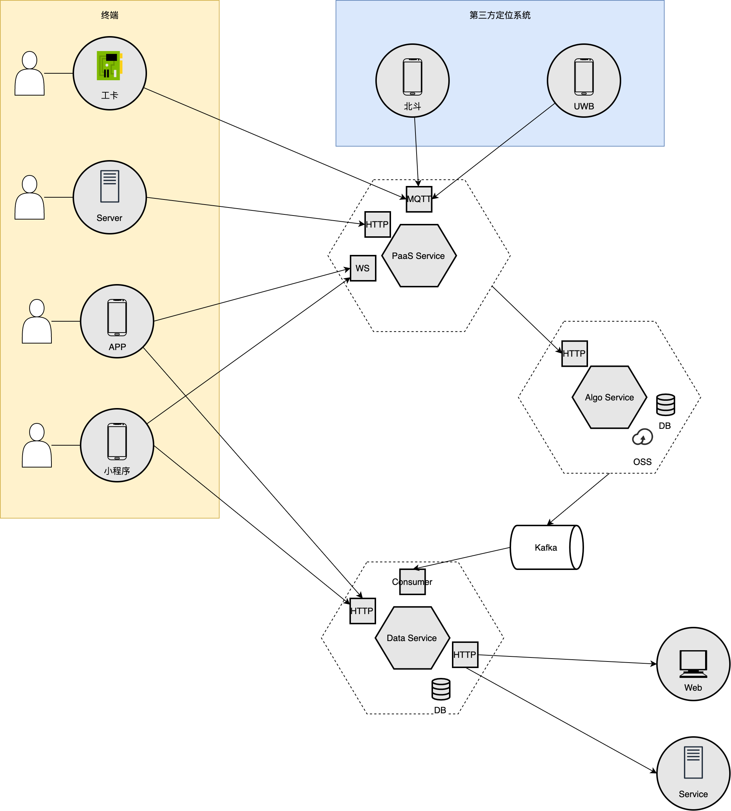
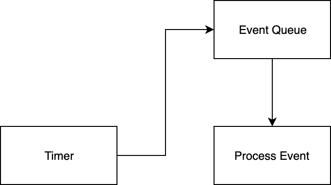
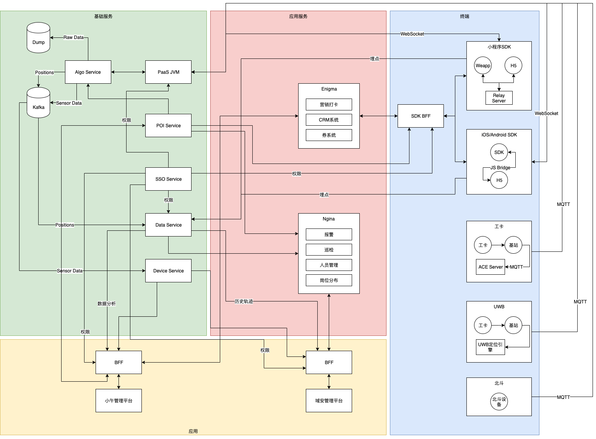

# 定位服务
## 定位服务整体架构
整个系统中，我们将定位服务分为5个部分，分别为
- 终端
- 第三方服务：包括北斗、UWB、GPS等带有第三方定位引擎的系统
- PaaS Service
- Algo Service
- Data Service

### PaaS Service
PaaS Service处理连接层服务，包括的功能有：
- 提供数据类型适配
- 提供数据协议适配，包括Socket, Web Socket, Http, MQTT等
- 提供设备的路由
- 保持连接的状态
- 保证定位数据的时序

其内部架构如下：

PaaS为典型的分层设计，分为三层
- 连接层：Connector，负责适配各种协议
- 路由层：Router，负责将协议的数据发送到对应的计算单元
- 计算层：Tracer，一个设备（SDK, 小程序，工卡等）一个tracer

在Router设计中，会有很多route rule，如：
- Multi Device:可以将一个连接中多个设备的数据拆分，发送到不同的tracer中
- Site/Floor：可以根据site_id/floor_id，将数据发送到相同节点的trace
各个router可以做级连使用

#### Tracer
Tracer的设计是event driven，严格保持事件驱动机制，单线程，结构如下

## Algo Service
Algo Service作为算法的计算服务，需要负责
- 定位算法计算
- 图存储
- 状态存储
- 原始数据保持
- 定位数据输出

# 小午 域安系统架构

# 蓝牙车辆定位
产品整体需求：满足定位终端(手机, app和小程序)由行人或者车辆从室外到室内的定位一体化功能
技术需求：
- 室外GPS定位
- GPS-IBeaon定位切换
- IBeacon定位：人载/车载

