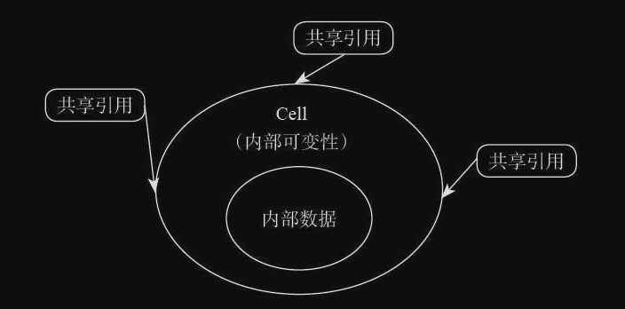
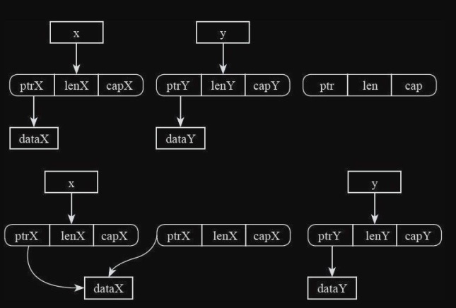
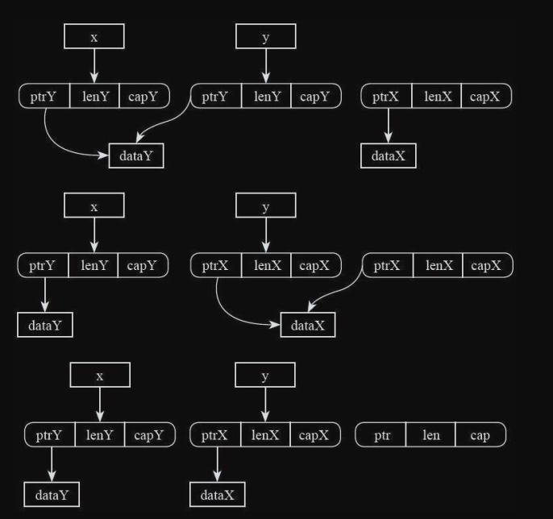

# 内存安全
不带自动内存回收（Garbage Collection）的内存安全是Rust语言最重要的创新，是它与其他语言最主要的区别所在，是Rust语言设计的核心。

## 内存管理基础

### 堆和栈
一个进程在执行的时候，它所占用的内存的虚拟地址空间一般被分割成好几个区域，我们称为“段”（Segment）。常见的几个段如下
- 代码段。编译后的机器码存在的区域。一般这个段是只读的
- bss段。存放未初始化的全局变量和静态变量的区域。
- 数据段。存放有初始化的全局变量和静态变量的区域。
- 函数调用栈（call stack segment）。存放函数参数、局部变量以及其他函数调用相关信息的区域。
- 堆（heap）。存放动态分配内存的区域

一般来说，CPU有专门的指令可以用于入栈或者出栈的操作。当一个函数被调用时，就会有指令把当前指令的地址压入栈内保存起来，然后跳转到被调用的函数中执行。函数返回的时候，就会把栈里面先前的指令地址弹出来继续执行

堆是为动态分配预留的内存空间，和栈不一样，从堆上分配和重新分配块没有固定模式，用户可以在任何时候分配和释放它。这样就使得跟踪哪部分堆已经被分配和被释放变得异常复杂；有许多定制的堆分配策略用来为不同的使用模式下调整堆的性能。堆是在内存中动态分配的内存，是无序的。每个线程都有一个栈，但是每一个应用程序通常都只有一个堆。在堆上的变量必须要手动释放，不存在作用域的问题。

一般来说，操作系统提供了在堆上分配和释放内存的系统调用，但是用户不是直接使用这个系统调用，而是使用封装的更好的“内存分配器”（Allocator）。

堆和栈之间的区别有：
- 栈上保存的局部变量在退出当前作用域的时候会自动释放
- 堆上分配的空间没有作用域，需要手动释放
- 一般栈上分配的空间大小是编译阶段就可以确定的
- 栈有一个确定的最大长度，超过了这个长度会产生“栈溢出”（stack overflow）
- 堆的空间一般要更大一些，堆上的内存耗尽了，就会产生“内存分配不足”

### 段错误
`segfault`实际上是“segmentation fault”的缩写形式，我们可以翻译为“段错误”。`segfault`是这样形成的：进程空间中的每个段通过硬件`MMU`映射到真正的物理空间；在这个映射过程中，我们还可以给不同的段设置不同的访问权限，比如代码段就是只能读不能写；进程在执行过程中，如果违反了这些权限，CPU会直接产生一个硬件异常；硬件异常会被操作系统内核处理，一般内核会向对应的进程发送一条信号；如果没有实现自己特殊的信号处理函数，默认情况下，这个进程会直接非正常退出；如果操作系统打开了core dump功能，在进程退出的时候操作系统会把它当时的内存状态、寄存器状态以及各种相关信息保存到一个文件中，供用户以后调试使用。

编程语言规避`segfault`的办法是使用自动垃圾回收机制。在这些编程语言中，指针的能力被大幅限制，内存分配和释放都在一个运行时环境中被严格管理
Rust的主要设计目标之一，是在不用自动垃圾回收机制的前提下避免产生`segfaul`

### 内存安全
Memory safety is the state of being protected from various software bugs and security vulnerabilities when dealing with memory access，such asbuffer overflows and dangling pointers
内存安全是指在处理内存访问时免受各种软件错误和安全漏洞的影响，例如缓冲区溢出和悬空指针

下面列举一系列的“内存不安全”的例子。
- 空指针: 解引用空指针是不安全的。这块地址空间一般是受保护的，对空指针解引用在大部分平台上会产生`segfault`。
- 野指针: 野指针指的是未初始化的指针。它的值取决于它这个位置以前遗留下来的是什么值。所以它可能指向任意一个地方。对它解引用，可能会造成`segfault`，也可能不会，纯粹凭运气。但无论如何，这个行为都不会是你预期内的行为，是一定会产生bug的。
- 悬空指针: 悬空指针指的是内存空间在被释放了之后，继续使用。它跟野指针类似，同样会读写已经不属于这个指针的内容。
- 使用未初始化内存: 不只是指针类型，任何一种类型不初始化就直接使用都是危险的，造成的后果我们完全无法预测。
- 非法释放: 内存分配和释放要配对。如果对同一个指针释放两次，会制造出内存错误。如果指针并不是内存分配器返回的值，对其执行释放操作，也是危险的。
- 缓冲区溢出: 指针访问越界了，结果也是类似于野指针，会读取或者修改临近内存空间的值，造成危险。
- 执行非法函数指针: 如果一个函数指针不是准确地指向一个函数地址，那么调用这个函数指针会导致一段随机数据被当成指令来执行，是非常危险的。
- 数据竞争: 在有并发的场景下，针对同一块内存同时读写，且没有同步措施


## 所有权和移动语义
###  什么是所有权
拿C语言的代码来打个比方。我们可能会在堆上创建一个对象，然后使用一个指针来管理这个对象：
```c
Foo *p = make_object("args");
```

接下来，我们可能需要使用这个对象：
```c
use_object(p);
```

然而，这段代码之后，谁能猜得到，指针p指向的对象究竟发生了什么？它是否被修改过了？它还存在吗，是否已经被释放？是否有另外一个指针现在也同时指向这个对象？我们还能继续读取、修改或者释放这个对象吗？实际上，除了去了解use_object的内部实现之外，我们没办法回答以上问题。

对此，C++进行了一个改进，即通过“智能指针”来描述“所有权”（Ownership）概念。这在一定程度上减少了内存使用bug，实现了“半自动化”的内存管理。
而Rust在此基础上更进一步，将“所有权”的理念直接融入到了语言之中。

“所有权”代表着以下意义：
- 每个值在Rust中都有一个变量来管理它，这个变量就是这个值、这块内存的所有者；
- 每个值在一个时间点上只有一个管理者
- 当变量所在的作用域结束的时候，变量以及它代表的值将会被销毁

拿前面已经讲过的字符串String类型来举例:
```rs
fn main() {
  let mut s = String::from("hello");
  s.push_str(" world");
  println!("{}", s);
}
```

当我们声明一个变量`s`，并用`String`类型对它进行初始化的时候，这个变量`s`就成了这个字符串的“所有者”。如果我们希望修改这个变量，可以使用`mut`修饰`s`，然后调用`String`类型的成员方法来实现。当`main`函数结束的时候，`s`将会被析构，它管理的内存（不论是堆上的，还是栈上的）则会被释放。

我们一般把变量从出生到死亡的整个阶段，叫作一个变量的“生命周期”。

在上述示例的基础上，若做一点修改：
```rs
fn main() {
  let s = String::from("hello");
  let s1 = s;
  println!("{}", s);
}

error[E0382]: use of moved value: `s`
--> test.rs:5:20
|
4 | let s1 = s;
| -- value moved here
5 | println!("{}", s);
| ^ value used here after move
|
= note: move occurs because `s` has type `std::string::String`, which does not imp
```

### 移动语义
一个变量可以把它拥有的值转移给另外一个变量，称为“所有权转移”。`赋值语句`、`函数调用`、`函数返回`等，都有可能导致所有权转移。

```rs
fn create() -> String {
  let s = String::from("hello");
  return s; // 所有权转移,从函数内部移动到外部
}
fn consume(s: String) { // 所有权转移,从函数外部移动到内部
  println!("{}", s);
}
fn main() {
  let s = create();
  consume(s);
}
```

Rust中所有权转移的重要特点是，它是所有类型的`默认`语义
Rust中的变量绑定操作，默认是`move`语义，执行了新的变量绑定后，原来的变量就不能再被使用

### 复制语义
默认的`move`语义是Rust的一个重要设计，但是任何时候需要复制都去调用`clone`函数会显得非常烦琐。对于一些简单类型，比如`整数`、`bool`，让它们在赋值的时候默认采用复制操作会让语言更简单。

```rs
fn main() {
  let v1 : isize = 0;
  let v2 = v1;
  println!("{}", v1);
}
```
在Rust中有一部分“特殊照顾”的类型，其变量绑定操作是`copy`语义。所谓的`copy`语义，是指在执行变量绑定操作的时候，`v2`是对`v1`所属数据的一份复制。`v1`所管理的这块内存依然存在，并未失效，而`v2`是新开辟了一块内存，它的内容是从`v1`管理的内存中复制而来的。和手动调用`clone`方法效果一样，`let v2=v1;`等效于`let v2=v1.clone();`。

Rust中，在普通变量绑定、函数传参、模式匹配等场景下，凡是实现了`std::marker::Copy` trait的类型，都会执行`copy`语义。基本类型，比如数字、字符、bool等，都实现了Copy trait，因此具备copy语义。
对于自定义类型，默认是没有实现Copy trait的，但是我们可以手动添上。示例如下：
`Copy`继承了`Clone`，我们要实现`Copy trait`必须同时实现`Clone trait`。
```rs
struct Foo {
  data : i32
}
impl Clone for Foo {
  fn clone(&self) -> Foo {
    Foo { data : self.data }
  }
}
impl Copy for Foo {}
fn main() {
  let v1 = Foo { data : 0 };
  let v2 = v1;
  println!("{:?}", v1.data);
}
```
绝大部分情况下，实现`Copy trait`和`Clone trait`是一个非常机械化的、重复性的工作，`clone`方法的函数体要对每个成员调用一下`clone`方法。Rust提供了一个编译器扩展`derive attribute`，来帮我们写这些代码，其使用方式为`#[derive(Copy，Clone)]`。只要一个类型的所有成员都具有`Clone trait`，我们就可以使用这种方法来让编译器帮我们实现`Clone trait`了。


### Box类型
代表“拥有所有权的指针”
```rs
struct T{
  value: i32
}
fn main() {
  let p = Box::new(T{value: 1});
  println!("{}", p.value);
}
```

`Box`类型永远执行的是`move`语义，不能是`copy`语义。
Rust中的copy语义就是浅复制。对于Box这样的类型而言，浅复制必然会造成二次释放问题。

对于Rust里面的所有变量，在使用前一定要合理初始化，否则会出现编译错误。对于`Box<T>/&T/&mut T`这样的类型，合理初始化意味着它一定指向了某个具体的对象，不可能是空。如果用户确实需要“可能为空的”指针，必须使用类型`Option<Box<T>>`。


### Clone VS. Copy
Rust中的`Copy`是一个特殊的trait，它给类型提供了“复制”语义。在Rust标准库里面，还有一个跟它很相近的trait，叫作`Clone`。

### Copy的含义
`Copy`的全名是`std::marker::Copy`。请大家注意，`std::marker`模块里面所有的trait都是特殊的trait。目前稳定的有四个，它们是`Copy`、`Send`、`Sized`、`Sync`。它们的特殊之处在于：它们是跟编译器密切绑定的，`impl`这些trait对编译器的行为有重要影响。在编译器眼里，它们与其他的trait不一样。这几个trait内部都没有方法，它们的唯一任务是给类型打一个“标记”，表明它符合某种约定——这些约定会影响编译器的静态检查以及代码生成。

`Copy`这个trait在编译器的眼里代表的是什么意思呢？简单点总结就是，如果一个类型`impl`了`Copy trait`，意味着任何时候，我们都可以通过简单的内存复制（在C语言里按字节复制memcpy）实现该类型的复制，并且不会产生任何内存安全问题。

一旦一个类型实现了`Copy trait`，那么它在变量绑定、函数参数传递、函数返回值传递等场景下，都是copy语义，而不再是默认的move语义。

### Copy的实现条件
并不是所有的类型都可以实现`Copy trait`。Rust规定，对于自定义类型，只有所有成员都实现了`Copy trait`，这个类型才有资格实现`Copy trait`。
常见的`数字类型`、`bool类型`、`共享借用指针&`，都是具有`Copy`属性的类型。而`Box`、`Vec`、`可写借用指针&mut`等类型都是不具备`Copy`属性的类型。
对于`数组`类型，如果它内部的元素类型是`Copy`，那么这个数组也是`Copy`类型。
对于元组`tuple`类型，如果它的每一个元素都是`Copy`类型，那么这个`tuple`也是`Copy`类型。
`struct`和`enum`类型不会自动实现`Copy trait`。只有当`struct`和`enum`内部的每个元素都是`Copy`类型时，编译器才允许我们针对此类型实现`Copy trait`。


### Clone的含义
`Clone`的全名是`std::clone::Clone`。它的完整声明如下：
```rs
pub trait Clone : Sized {
  fn clone(&self) -> Self;
  fn clone_from(&mut self, source: &Self) {
    *self = source.clone()
  }
}
```

它有两个关联方法，分别是`clone_from`和`clone`，`clone_from`是有默认实现的，依赖于`clone`方法的实现。`clone`方法没有默认实现，需要手动实现。

`clone`方法一般用于“基于语义的复制”操作。所以，它做什么事情，跟具体类型的作用息息相关。比如，对于`Box`类型，`clone`执行的是“深复制”；而对于`Rc`类型，`clone`做的事情就是把引用计数值加`1`。

对于实现了`copy`的类型，它的`clone`方法应该跟`copy`语义相容，等同于按字节复制


### 自动derive
自动生成的`clone`方法，会依次调用每个成员的`clone`方法

通过`derive`方式自动实现`Copy`和手工实现`Copy`有微小的区别。当类型具有泛型参数的时候，比如`struct MyStruct<T>{}`，通过`derive`自动生成的代码会自动添加一个`T: Copy`的约束。


### 总结
`Copy`和`Clone`两者的区别和联系如下:
- `Copy`内部没有方法，`Clone`内部有两个方法
- `Copy trait`是给编译器用的，告诉编译器这个类型默认采用`copy`语义，而不是`move`语义。`Clone trait`是给程序员用的，我们必须手动调用`clone`方法，它才能发挥作用。
- `Copy trait`不是想实现就能实现的，它对类型是有要求的，有些类型不可能`impl Copy`。而`Clone trait`则没有什么前提条件，任何类型都可以实现（`unsized`类型除外，因为无法使用`unsized`类型作为返回值）。
- `Copy trait`规定了这个类型在执行`变量绑定`、`函数参数传递`、`函数返回`等场景下的操作方式。即这个类型在这种场景下，必然执行的是“简单内存复制”操作，这是由编译器保证的，程序员无法控制。`Clone trait`里面的`clone`方法究竟会执行什么操作，则是取决于程序员自己写的逻辑。一般情况下，`clone`方法应该执行一个“深复制”操作，但这不是强制性的，如果你愿意，在里面启动一个人工智能程序都是有可能的。
- Rust语言规定了在`T: Copy`的情况下，`Clone trait`代表的含义。即：当某变量`t: T`符合`T: Copy`时，它调用`t.clone()`方法的含义必须等同于“简单内存复制”。也就是说，`clone`的行为必须等同于`let x=std::ptr::read(&t);`，也等同于`let x=t;`。当`T: Copy`时，我们不要在`Clone trait`里面乱写自己的逻辑。所以，当我们需要指定一个类型是`Copy`的时候，最好使用`#[derive(Copy，Clone)]`方式，避免手动实现`Clone`导致错误。


### 析构函数
“析构函数”是对象被销毁的时候调用的函数

相对于构造函数，析构函数有更重要的作用。它会在对象消亡之前由编译器自动调用，因此特别适合承担对象销毁时释放所拥有的资源的作用。比如，`Vec`类型在使用的过程中，会根据情况动态申请内存，当变量的生命周期结束时，就会触发该类型的析构函数的调用。在析构函数中，我们就有机会将所拥有的内存释放掉。在析构函数中，我们还可以根据需要编写特定的逻辑，从而达到更多的目的。析构函数不仅可以用于管理内存资源，还能用于管理更多的其他资源，如文件、锁、socket等。

在Rust中编写“析构函数”的办法是`impl std::ops::Drop`。`Drop trait`的定义如下：
```rs
trait Drop {
  fn drop(&mut self);
}
```

```rs
use std::ops::Drop;
struct D(i32);
impl Drop for D {
  fn drop(&mut self) {
    println!("destruct {}", self.0);
  }
}
fn main() {
  let _x = D(1);
  println!("construct 1");
  {
    let _y = D(2);
    println!("construct 2");
    println!("exit inner scope");
  }
  println!("exit main function");
}

// construct 1
// construct 2
// exit inner scope
// destruct 2
// exit main function
// destruct 1
```

对于具有多个局部变量的情况，析构函数的调用顺序是：先构造的后析构，后构造的先析构。因为局部变量存在于一个“栈”的结构中，要保持“先进后出”的策略。

### 主动析构
用户主动调用析构函数是非法的
```rs
fn main() {
  let p = Box::new(42);
  p.drop();
  println!("{}", p);
}

error[E0040]: explicit use of destructor method
--> test.rs:5:7
|
5 | p.drop();
| ^^^^ explicit destructor calls not allowed
```

让局部变量在语句块结束前提前终止生命周期,调用标准库中的`std::mem::drop`函数
```rs
use std::mem::drop;
fn main() {
  let mut v = vec![1, 2, 3]; // <--- v的生命周期开始
  drop(v); // ---> v的生命周期结束
  v.push(4); // 错误的调用
}
```

标准库中的`std::mem::drop`函数是怎样实现的呢
```rs
#[inline]
pub fn drop<T>(_x: T) { }
```

`drop`函数不需要任何的函数体，只需要参数为“值传递”即可。将对象的所有权移入函数中，什么都不用做，编译器就会自动释放掉这个对象了。
因为这个`drop`函数的关键在于使用`move`语义把参数传进来，使得变量的所有权从调用方移动到`drop`函数体内，参数类型一定要是`T`，而不是`&T`或者其他引用类型。函数体本身其实根本不重要，重要的是把变量的所有权`move`进入这个函数体中，函数调用结束的时候该变量的生命周期结束，变量的析构函数会自动调用，管理的内存空间也会自然释放。这个过程完全符合前面讲的生命周期、`move`语义，无须编译器做特殊处理。

因此，对于`Copy`类型的变量，对它调用`std::mem::drop`函数是没有意义的。


### Drop VS. Copy
要想实现`Copy trait`，类型必须满足一定条件。这个条件就是：如果一个类型可以使用`memcpy`的方式执行复制操作，且没有内存安全问题，那么它才能被允许实现`Copy trait`。反过来，所有满足`Copy trait`的类型，在需要执行`move`语义的时候，使用`memcpy`复制一份副本，不删除原件是完全不会产生安全问题的
带有析构函数的类型都是不能满足`Copy`语义的。因为我们不能保证，对于带析构函数的类型，使用`memcpy`复制一个副本一定不会有内存安全问题。所以对于这种情况，编译器是直接禁止的。


### 析构标记
析构函数是在变量生命周期结束的时候被调用的。然而，既然我们可以手动提前终止变量的生命周期，那么就说明，变量的生命周期并不是简单地与某个代码块一致，生命周期何时结束，很可能是由运行时的条件决定的。
下面用一个示例来说明变量的析构函数调用时机是有可能在运行阶段发生改变的：
```rs
use std::ops::Drop;
use std::mem::drop;
struct D(&'static str);
impl Drop for D {
  fn drop(&mut self) {
    println!("destructor {}", self.0);
  }
}
// 获取 DROP 环境变量的值,并转换为整数
fn condition() -> Option<u32> {
  std::env::var("DROP")
    .map(|s| s.parse::<u32>().unwrap_or(0))
    .ok()
}
fn main() {
  let var = (D("first"), D("second"), D("third"));
  match condition() {
    Some(1) => drop(var.0),
    Some(2) => drop(var.1),
    Some(3) => drop(var.2),
    _ => {},
  }
  println!("main end");
}

// 没有设置DROP环境变量
// main end
// destructor first
// destructor second
// destructor third

// 设置了export DROP=2
// destructor second
// main end
// destructor first
// destructor third
```

析构函数的调用是在编译阶段就确定好了的，调用析构函数是编译器自动插入的代码做的。而且示例又表明，析构函数的具体调用时机还是跟运行时的情况相关的。那么编译器是怎么做到的呢？
编译器是这样完成这个功能的：首先判断一个变量是否可能会在多个不同的路径上发生析构，如果是这样，那么它会在当前函数调用栈中自动插入一个`bool`类型的标记，用于标记该对象的析构函数是否已经被调用, 生成的代码逻辑像下面这样：
```rs
// 以下为伪代码,仅仅是示意
fn main() {
  let var = (D("first"), D("second"), D("third"));
  // 当函数中有拥有所有权的对象时,需要有析构自动标记
  let drop_flag_0 = false; // ---
  let drop_flag_1 = false; // ---
  let drop_flag_2 = false; // ---
  // 退出语句块时,对当前block内拥有所有权的对象调用析构函数,并设置标记
  match condition() {
    Some(1) => {
      drop(var.0);
      if (!drop_flag_0) { // ---
        drop_flag_0 = true; // ---
      } // ---
    }
    Some(2) => {
      drop(var.1);
      if (!drop_flag_1) { // ---
        drop_flag_1 = true; // ---
    } // ---
    }
    Some(3) => {
      drop(var.2);
      if (!drop_flag_2) { // ---
        drop_flag_2 = true; // ---
      } // ---
    }
    _ => {},
  }
  println!("main end");
  // 退出语句块时,对当前block内拥有所有权的对象调用析构函数,并设置标记
  if (!drop_flag_0) { // ---
    drop(var.0); // ---
    drop_flag_0 = true; // ---
  } // ---
  if (!drop_flag_1) { // ---
    drop(var.1); // ---
    drop_flag_1 = true; // ---
  } // ---
  if (!drop_flag_2) { // ---
    drop(var.2); // ---
    drop_flag_2 = true; // ---
  } // ---
}
```


## 借用和生命周期
### 生命周期
一个变量的生命周期就是它从创建到销毁的整个过程

然而，如果一个变量永远只能有唯一一个入口可以访问的话，那就太难使用了。因此，所有权还可以借用。

### 借用
变量对其管理的内存拥有所有权。这个所有权不仅可以被转移（move），还可以被借用（borrow）。
借用指针的语法使用`&`符号或者`&mut`符号表示。前者表示只读借用，后者表示可读写借用。借用指针（borrow pointer）也可以称作“引用”（reference）。借用指针与普通指针的内部数据是一模一样的，唯一的区别是语义层面上的。它的作用是告诉编译器，它对指向的这块内存区域没有所有权。

对于`&mut`型指针，请大家注意不要混淆它与变量绑定之间的语法。如果`mut`修饰的是变量名，那么它代表这个变量可以被重新绑定；如果`mut`修饰的是“借用指针&”，那么它代表的是被指向的对象可以被修改。
借用指针在编译后，实际上就是一个普通的指针，它的意义只能在编译阶段的静态检查中体现

### 借用规则
关于借用指针，有以下几个规则：
- 借用指针不能比它指向的变量存在的时间更长
- `&mut`型借用只能指向本身具有`mut`修饰的变量，对于只读变量，不可以有`&mut`型借用。
- `&mut`型借用指针存在的时候，被借用的变量本身会处于“冻结”状态
- 如果只有`&`型借用指针，那么能同时存在多个；如果存在`&mut`型借用指针，那么只能存在一个；如果同时有其他的`&`或者`&mut`型借用指针存在，那么会出现编译错误。

借用指针只能临时地拥有对这个变量读或写的权限，没有义务管理这个变量的生命周期。因此，借用指针的生命周期绝对不能大于它所引用的原来变量的生命周期，否则就是悬空指针，会导致内存不安全。


### 生命周期标记
当生命周期跨函数的时候，就需要一种特殊的生命周期标记符号了

#### 函数的生命周期标记

#### 类型的生命周期标记
如果自定义类型中有成员包含生命周期参数，那么这个自定义类型也必须有生命周期参数
```rs
struct Test<'a> {
  member: &'a str
}
```

在使用impl的时候，也需要先声明再使用：
```rs
impl<'t> Test<'t> {
  fn test<'a>(&self, s: &'a str) {
  }
}
```

`impl`后面的那个`'t`是用于声明生命周期参数的，后面的`Test<'t>`是在类型中使用这个参数。如果有必要的话，方法中还能继续引入新的泛型参数。


## 借用检查
Rust语言的核心特点是：在没有放弃对内存的直接控制力的情况下，实现了内存安全。
对内存的直接控制能力:可以自行决定内存布局，包括在栈上分配内存，还是在堆上分配内存；支持指针类型；可以对一个变量实施取地址操作；有确定性的内存释放；


介绍一下这两个概念Alias和Mutation。
`Alias`的意思是“别名”。如果一个变量可以通过多种`Path`来访问，那它们就可以互相看作`alias`。`Alias`意味着“共享”，我们可以通过多个入口访问同一块内存。
`Mutation`的意思是“改变”。如果我们通过某个变量修改了一块内存，就是发生了`mutation`。`Mutation`意味着拥有“修改”权限，我们可以写入数据

Rust保证内存安全的一个重要原则就是，如果能保证alias和mutation不同时出现，那么代码就一定是安全的

### 内存不安全示例：修改枚举
```rs
enum StringOrInt {
  Str(String),
  Int(i64),
}
```

它有两个元素，分别可以携带`String`类型的信息以及`i64`类型的信息。假如我们有一个引用指向了它的内部数据，同时再修改这个变量，大家猜想会发生什么情况？这样做可能会出现内存安全问题，因为我们有机会用一个`String`类型的指针指向`i64`类型的数据，或者用一个`i64`类型的指针指向`String`类型的数据。完整示例如下：
```rs
use std::fmt::Debug;
#[derive(Debug)]
enum StringOrInt {
  Str(String),
  Int(i64),
}
fn main() {
  use StringOrInt::{Str, Int};
  let mut x = Str("Hello world".to_string());
  if let Str(ref insides) = x {
    x = Int(1);
    println!("inside is {}, x says: {:?}", insides, x);
  }
}

// error: cannot assign to `x` because it is borrowed [E0506]
```

在这段代码中，我们用`if let`语法创建了一个指向内部`String`的指针，然后在此指针的生命周期内，再把`x`内部数据变成`i64`类型。这是典型的内存不安全的场景。


### 内存不安全示例：迭代器失效
如果在遍历一个数据结构的过程中修改这个数据结构，会导致迭代器失效。
```rs
fn main() {
  let mut arr = vec!["ABC", "DEF", "GHI"];
  for item in &arr {
    arr.clear();
  }
}
```

Rust里面的`for`循环实质上是生成了一个迭代器，它一直持有一个指向容器的引用，在迭代器的生命周期内，任何对容器的修改都是无法编译通过的
```rs
{ //以下是伪代码
  // 在iter变量的生命周期内,它都持有一个指向arr的引用
  let iter<'a> = into_iter(&'a arr);
  loop {
    match iter.next() {
      // 如果需要使用 arr 的 &mut 指针,则会发生冲突
      // &mut arr 和 &arr 不能同时存在,它违反了Rust内存安全的原则
      Some(i) => { arr.clear(); }
      None => break ,
    }
  }
}
```

在整个`for`循环的范围内，这个迭代器的生命周期都一直存在。而它持有一个指向容器的引用，`&`型或者`&mut`型，根据情况而定。迭代器的API设计是可以修改当前指向的元素，没办法修改容器本身的。当我们想在这里对容器进行修改的时候，必然需要产生一个新的针对容器的`&mut`型引用，（clear方法的签名是`Vec::clear(&mut self)`，调用`clear`必然产生对原`Vec`的`&mut`型引用）。这是与Rust的“alias+mutation”规则相冲突的，所以编译不通过。

### 内存不安全示例：悬空指针
使用动态数组类型，使用一个指针指向它的第一个元素，然后在原来的动态数组中插入数据：
```rs
fn main() {
  let mut arr : Vec<i32> = vec![1,2,3,4,5];
  let p : &i32 = &arr[0];
  for i in 1..100 {
    arr.push(i);
  }
}

// error: cannot borrow `arr` as mutable because it is also borrowed as immutable
```

在存在一个不可变引用的情况下，我们不能修改原来变量的值


## NLL（Non-Lexical-Lifetime）
如果你对同一块内存存在多个引用，就不要试图对这块内存做修改；如果你需要对一块内存做修改，就不要同时保留多个引用。只要保证了这个原则，我们就可以保证内存安全。

让借用指针的生命周期规则与普通对象的生命周期规则一样，是按作用域来确定的。所有的变量、借用的生命周期就是从它的声明开始，到当前整个语句块结束。这个设计被称为`Lexical Lifetime`，因为生命周期是严格和词法中的作用域范围绑定的。
某些情况下借用的范围被过度拉长了，以至于某些实质上是安全的代码也被阻止了。

因此，Rust核心组又决定引入Non Lexical Lifetime，用更精细的手段调节借用真正起作用的范围。这就是NLL。


### NLL希望解决的问题
```rs
use std::ascii::AsciiExt;
fn foo() -> Vec<char> {
  let mut data = vec!['a', 'b', 'c']; // --+ 'scope
  // let slice = &mut data[..];// <-----------+ 'lifetime
  // capitalize(slice);
  capitalize(&mut data[..]); // |
  // ^~~~~~~~~~~~~~~~~~~~~~~~~ 'lifetime // |
  data.push('d'); // |
  data.push('e'); // |
  data.push('f'); // |
  data // |
  // <-----------------------------------------+
}
fn capitalize(data: &mut [char]) {
  for c in data {
    c.make_ascii_uppercase();
  }
}
fn main() {
  let v = foo();
  println!("{:?}", v);
}
```

这段代码是没有问题的, 但是，如果我们把这段代码稍作修改，问题就出现了（注释）
在这段代码中，我们创建了一个临时变量`slice`，保存了一个指向`data`的`&mut`型引用，然后再调用`capitalize`函数，就出问题了。编译器提示为：
> error[E0499]: cannot borrow `data` as mutable more than once at a time

这是因为，Rust规定“共享不可变，可变不共享”，同时出现两个`&mut`型借用是违反规则的。在编译器报错的地方，编译器认为`slice`依然存在，然而又使用`data`去调用`fn push（&mut self，value：T）`方法，必然又会产生一个`&mut`型借用，这违反了Rust的原则。


```rs
fn process_or_default<K,V:Default>(map: &mut HashMap<K,V>, key: K){
  match map.get_mut(&key) { // -------------+ 'lifetime
    Some(value) => process(value), // |
    None => { // |
      map.insert(key, V::default()); // |
      // ^~~~~~ ERROR. // |
    } // |
  } // <------------------------------------+
}
```

目前这段代码是编译不过的，因为编译器会认为在调用`get_mut（&key）`的时候，产生了一个指向`map`的`&mut`型引用，而且它的返回值也包含了一个引用，返回值的生命周期是和参数的生命周期一致的。这个方法的返回值会一直存在于整个`match`语句块中，所以编译器判定，针对`map`的引用也是一直存在于整个`match`语句块中的。于是后面调用`insert`方法会发生冲突。
当然，如果我们从逻辑上来理解这段代码，就会知道，这段代码其实是安全的。因为在`None`分支，意味着`map`中没有找到这个`key`，在这条路径上自然也没有指向`map`的引用存在。但是可惜，在老版本的编译器上，如果我们希望让这段代码编译通过，只能绕一下。我们试一下做如下的修复
```rs
fn get_default1<'m,K,V:Default>(map: &'m mut HashMap<K,V>,key: K)-> &'m mut V{
  match map.get_mut(&key) { // -------------+ 'm
    Some(value) => return value, // |
    None => { } // |
  } // |
  map.insert(key, V::default()); // |
  // ^~~~~~ ERROR (still) |
  map.get_mut(&key).unwrap() // |
} 
```

实际上这个改动依然会编译失败。原因就在于`return`语句，`get_mut`时候对`map`的借用传递给了`Some（value）`，在`Some`这个分支内存在一个引用，指向`map`的某个部分，而我们又把`value`返回了，这意味着编译器认为，这个借用从`match`开始一直到退出这个函数都存在。因此后面的`insert`调用依然发生了冲突。接下来我们再做一次修复：
```rs
fn get_default2<'m,K,V:Default>(map: &'m mut HashMap<K,V>,key: K)-> &'m mut V{
  if map.contains(&key) {
  // ^~~~~~~~~~~~~~~~~~ 'n
    return match map.get_mut(&key) { // + 'm
      Some(value) => value, // |
      None => unreachable!() // |
    }; // v
  }
  // At this point, `map.get_mut` was never
  // called! (As opposed to having been called,
  // but its result no longer being in use.)
  map.insert(key, V::default()); // OK now.
  map.get_mut(&key).unwrap()
}
```

这次的区别在于，`get_mut`发生在一个子语句块中。在这种情况下，编译器会认为这个借用跟`if`外面的代码没什么关系。通过这种方式，我们终于绕过了`borrow checker`。但是，为了绕过编译器的限制，我们付出了一些代价。这段代码，我们需要执行两次hash查找，一次在contains方法，一次在get_mut方法，因此它有额外的性能开销。这也是为什么标准库中的HashMap设计了一个叫作`entry`的api，如果用entry来写这段逻辑，可以这么做：
```rs
fn get_default3<'m,K,V:Default>(map: &'m mut HashMap<K,V>,key: K)-> &'m mut V{
  map.entry(key).or_insert_with(|| V::default())
}
```

### NLL的原理
NLL的设计目的是让“借用”的生命周期不要过长，适可而止，避免不必要的编译错误，把实际上正确的代码也一起拒绝掉。但是实现方法不能是简单地在AST上找以下某个引用最后一次在哪里使用，就让它的生命周期结束算了。我们用例子来说明：
```rs
fn baz() {
  let mut data = vec!['a', 'b', 'c'];
  let slice = &mut data[..]; // <-+ lifetime if we ignored
  loop { // | variables altogether
    capitalize(slice); // |
    // <------------------------+
    data.push('d'); // Should be error, but would not be.
  }
  data.push('e'); // OK
  data.push('f'); // OK
}
```

如果执行了`push（）`方法后，引发了`Vec`数据结构的扩容，它把以前的空间释放掉，申请了新的空间，进入下一轮循环的时候，`slice`就会指向一个非法地址，会出现内存不安全。以上这段代码理应出现编译错误。
因此，新版本的借用检查器将不再基于AST的语句块来设计，而是将AST转换为另外一种中间表达形式MIR（middle-level intermediaterepresentation）之后，在MIR的基础上做分析。
可以用以下编译器命令打印出MIR的文本格式：
```sh
rustc --emit=mir test.rs
```


## 内部可变性
Rust的borrow checker的核心思想是“共享不可变，可变不共享”。但是只有这个规则是不够的，在某些情况下，我们的确需要在存在共享的情况下可变。为了让这种情况是可控的、安全的，Rust还设计了一种“内部可变性”（interior mutability）。

Rust中的mut关键字不能在声明类型的时候使用，只能跟变量一起使用。类型本身不能规定自己是否是可变的。一个变量是否是可变的，取决于它的使用环境，而不是它的类型。可变还是不可变取决于变量的使用方式，这就叫作“承袭可变性”。

如果我们用`let var：T；`声明，那么`var`是不可变的，同时，`var`内部的所有成员也都是不可变的；如果我们用`let mut var：T；`声明，那么`var`是可变的，相应的，它的内部所有成员也都是可变的。我们不能在类型声明的时候指定可变性，比如在`struct`中对某部分成员使用`mut`修饰，这是不合法的。我们只能在变量声明的时候指定可变性。我们也不能针对变量的某一部分成员指定可变性，其他部分保持不变。


常见的具备内部可变性特点的类型有`Cell`、`RefCell`、`Mutex`、`RwLock`、`Atomic*`等。其中`Cell`和`RefCell`是只能用在单线程环境下的具备内部可变性的类型


### Cell
如果我们有共享引用指向一个对象，那么这个对象就不会被更改了。因为在共享引用存在的期间，不能有可变引用同时指向它，因此它一定是不可变的
其实在Rust中，这种想法是不准确的。下面给出一个示例：
```rs
use std::rc::Rc;
fn main() {
  let r1 = Rc::new(1);
  println!("reference count {}", Rc::strong_count(&r1));
  let r2 = r1.clone();
  println!("reference count {}", Rc::strong_count(&r2));
}

// reference count 1
// reference count 2
```

`Rc`是Rust里面的引用计数智能指针
多个`Rc`指针可以同时指向同一个对象，而且有一个共享的引用计数值在记录总共有多少个`Rc`指针指向这个对象。

注意`Rc`指针提供的是共享引用，按道理它没有修改共享数据的能力。但是我们用共享引用调用`clone`方法，引用计数值发生了变化。这就是我们要说的“内部可变性”。如果没有内部可变性，标准库中的`Rc`类型是无法正确实现出来的。具备内部可变性的类型，最典型的就是`Cell`。

```rs
use std::cell::Cell;
fn main() {
  let data : Cell<i32> = Cell::new(100);
  let p = &data;
  vdata.set(10);
  println!("{}", p.get());
  p.set(20);
  println!("{:?}", data);

// 10
// Cell { value: 20 }
}
```

`data`这个变量绑定没有用`mut`修饰，`p`这个指针也没有用`&mut`修饰，然而不可变引用竟然可以调用`set`函数，改变了变量的值，而且还没有出现编译错误。


这就是所谓的内部可变性——这种类型可以通过共享指针修改它内部的值。虽然粗略一看，`Cell`类型似乎违反了Rust的“唯一修改权”原则。我们可以存在多个指向`Cell`类型的不可变引用，同时我们还能利用不可变引用改变`Cell`内部的值。但实际上，这个类型是完全符合“内存安全”的。我们再想想，为什么Rust要尽力避免alias和mutation同时存在？因为假如我们同时有可变指针和不可变指针指向同一块内存，有可能出现通过一个可变指针修改内存的过程中，数据结构处于被破坏状态的情况下，被其他的指针观测到。`Cell`类型是不会出现这样的情况的。因为`Cell`类型把数据包裹在内部，用户无法获得指向内部状态的指针，这意味着每次方法调用都是执行的一次完整的数据移动操作。每次方法调用之后，`Cell`类型的内部都处于一个正确的状态，我们不可能观察到数据被破坏掉的状态。

多个共享指针指向`Cell`类型的状态就类似图所示的这样，`Cell`就是一个“壳”，它把数据严严实实地包裹在里面，所有的指针只能指向`Cell`，不能直接指向数据。修改数据只能通过`Cell`来完成，用户无法创造一个直接指向数据的指针。


我们来仔细观察一下`Cell`类型提供的公开的API，就能理解`Cell`类型设计的意义了。下面是`Cell`类型提供的几个主要的成员方法：
```rs
impl<T> Cell<T> {
  pub fn get_mut(&mut self) -> &mut T { }
  pub fn set(&self, val: T) { }
  pub fn swap(&self, other: &Self) { }
  pub fn replace(&self, val: T) -> T { }
  pub fn into_inner(self) -> T { }
}
impl<T:Copy> Cell<T> {
  pub fn get(&self) -> T { }
}
```

- `get_mut`方法可以从`&mut Cell<T>`类型制造出一个`&mut T`型指针。因为`&mut`型指针具有“独占性”，所以这个函数保证了调用前，有且仅有一个“可写”指针指向`Cell`，调用后有且仅有一个“可写”指针指向内部数据。它不存在制造多个引用指向内部数据的可能性。
- `set`方法可以修改内部数据。它是把内部数据整个替换掉，不存在多个引用指向内部数据的可能性
- `swap`方法也是修改内部数据。跟`set`方法一样，也是把内部数据整体替换掉。与`std::mem::swap`函数的区别在于，它仅要求`&`引用，不要求`&mut`引用。
- `replace`方法也是修改内部数据。跟`set`方法一样，它也是把内部数据整体替换，唯一的区别是，换出来的数据作为返回值返回了。
- `into_inner`方法相当于把这个“壳”剥掉了。它接受的是`Self`类型，即`move`语义，原来的`Cell`类型的变量会被`move`进入这个方法，会把内部数据整体返回出来。
- `get`方法接受的是`&self`参数，返回的是`T`类型，它可以在保留之前`Cell`类型不变的情况下返回一个新的`T`类型变量，因此它要求`T：Copy`约束。每次调用它的时候，都相当于把内部数据`memcpy`了一份返回出去。


### RefCell
`RefCell`是另外一个提供了内部可变性的类型。它提供的方式与`Cell`类型有点不一样。`Cell`类型没办法制造出直接指向内部数据的指针，而`RefCell`可以
```rs
impl<T: ?Sized> RefCell<T> {
  pub fn borrow(&self) -> Ref<T> { }
  pub fn try_borrow(&self) -> Result<Ref<T>, BorrowError> { }
  pub fn borrow_mut(&self) -> RefMut<T> { }
  pub fn try_borrow_mut(&self) -> Result<RefMut<T>, BorrowMutError> { }
  pub fn get_mut(&mut self) -> &mut T { }
}
```

`get_mut`方法与`Cell::get_mut`一样，可以通过`&mut self`获得`&mutT`，这个过程是安全的。除此之外，`RefCell`最主要的两个方法就是`borrow`和`borrow_mut`，另外两个`try_borrow`和`try_borrow_mut`只是它们俩的镜像版，区别仅在于错误处理的方式不同。

```rs
use std::cell::RefCell;
fn main() {
  let shared_vec: RefCell<Vec<isize>> = RefCell::new(vec![1, 2, 3]);
  let shared1 = &shared_vec;
  let shared2 = &shared1;
  shared1.borrow_mut().push(4);
  println!("{:?}", shared_vec.borrow());
  shared2.borrow_mut().push(5);
  println!("{:?}", shared_vec.borrow());

  // [1, 2, 3, 4]
  // [1, 2, 3, 4, 5]
}
```


在函数的签名中，`borrow`方法和`borrow_mut`方法返回的并不是`&T`和`&mut T`，而是`Ref<T>`和`RefMut<T>`。它们实际上是一种“智能指针”，完全可以当作`&T`和`&mutT`的等价物来使用。标准库之所以返回这样的类型，而不是原生指针类型，是因为它需要这个指针生命周期结束的时候做点事情，需要自定义类型包装一下，加上自定义析构函数。

如果`borrow`和`borrow_mut`这两个方法可以制造出指向内部数据的只读、可读写指针，那么它是怎么保证安全性的呢？
答案是，`RefCell`类型放弃了编译阶段的alias+mutation原则，但依然会在执行阶段保证alias+mutation原则。
```rs
use std::cell::RefCell;
fn main() {
  let shared_vec: RefCell<Vec<isize>> = RefCell::new(vec![1, 2, 3]);
  let shared1 = &shared_vec;
  let shared2 = &shared1;
  let p1 = shared1.borrow();
  let p2 = &p1[0];
  shared2.borrow_mut().push(4);
  println!("{}", p2);
}
```

上面这个示例的意图是：我们先调用`borrow`方法，并制造一个指向数组第一个元素的指针，接着再调用`borrow_mut`方法，修改这个数组。这样，就构造出了同时出现alias和mutation的场景。

编译，通过。执行，问题来了，程序出现了panic：
> thread 'main' panicked at 'already borrowed: BorrowMutError', src\libcore\result.rs:860:4
  note: Run with `RUST_BACKTRACE=1` for a backtrace.

出现`panic`的原因是，`RefCell`探测到同时出现了alias和mutation的情况，它为了防止更糟糕的内存不安全状态，直接使用了panic来拒绝程序继续执行。如果我们用`try_borrow`方法的话，就会发现返回值是`Result::Err`，这是另外一种更友好的错误处理风格。

那么`RefCell`是怎么探测出问题的呢？原因是，`RefCell`内部有一个“借用计数器”，调用`borrow`方法的时候，计数器里面的“共享引用计数”值就加`1`。当这个`borrow`结束的时候，会将这个值自动减`1`。同样，`borrow_mut`方法被调用的时候，它就记录一下当前存在“可变引用”。如果“共享引用”和“可变引用”同时出现了，就会报错。


从原理上来说，Rust默认的“借用规则检查器”的逻辑非常像一个在编译阶段执行的“读写锁”（read-write-locker）。如果同时存在多个“读”的锁，是没问题的；如果同时存在“读”和“写”的锁，或者同时存在多个“写”的锁，就会发生错误。`RefCell`类型并没有打破这个规则，只不过，它把这个检查逻辑从编译阶段移到了执行阶段。

`Cell`和`RefCell`用得最多的场景是和多个只读引用相配合。比如，多个`&`引用或者`Rc`引用指向同一个变量的时候。我们不能直接通过这些只读引用修改变量，因为既然存在alias，就不能提供mutation。为了让存在多个alias共享的变量也可以被修改，那我们就需要使用内部可变性。Rust中提供了只读引用的类型有`&`、`Rc`、`Arc`等指针，它们可以提供alias。Rust中提供了内部可变性的类型有`Cell`、`RefCell`、`Mutex`、`RwLock`以及`Atomic*`系列类型等。这两类类型经常需要配合使用。

如果你需要把一个类型`T`封装到内部可变性类型中去，要怎样选择`Cell`和`RefCell`呢？原则就是，如果你只需要整体性地存入、取出`T`，那么就选`Cell`。如果你需要有个可读写指针指向这个`T`修改它，那么就选`RefCell`。


### UnsafeCell
标准库中的Cell类型是怎样实现的？
最简单的版本V1
```rs
struct CellV1<T> {
  value: T
}
impl<T> CellV1<T> {
  fn new(v: T) -> Self where T: Copy {
    CellV1 { value: v}
  }
  fn set(&self, v: T) {
    self.value = v;
  }
  fn get(&self) -> T where T: Copy {
    self.value
  }
}
```

这个版本是一个new type类型，内部包含了一个T类型的成员。成员方法对类型T都有恰当的约束。这些都没错。只有一个关键问题需要注意：对于`set`方法，直接这样写是肯定行不通的，因为`self`是只读引用，我们不可能直接对`self.value`赋值。而且，`Cell`类型最有用的地方就在于，它可以通过不可变引用改变内部的值。那么这个问题怎么解决呢？可以使用`unsafe`关键字。

```rs
struct CellV2<T> {
  value: T
}
impl<T> CellV2<T> {
  fn new(v: T) -> Self where T: Copy {
    CellV2 { value: v}
  }
  fn set(&self, v: T) where T: Copy {
    unsafe {
      let p = &(self.value) as *const T as *mut T;//此处实际上引入了未定义行为
      *p = v;
    }
  }
  fn get(&self) -> T where T: Copy {
    self.value
  }
}
```

在使用`unsafe`语句块之后，这段代码可以编译通过了。这里的关键是，在`unsafe`代码中，我们可以把`*const T`类型强制转换为`*mut T`类型。这是初学者最直观的解决方案，但这个方案是错误的。通过这种方式，我们获得了写权限。


```rs
struct Table<'arg> {
  cell: CellV2<&'arg isize>
}
fn evil<'long,'short>(t: &Table<'long>, s: &'short isize)
where 'long : 'short
{
  // The following assignment is not legal, but it escapes from lifetime checking
  let u: &Table<'short> = t;
  u.cell.set(s);
}
fn innocent<'long>(t: &Table<'long>) {
  let foo: isize = 1;
  evil(t, &foo);
}
fn main() {
  let local = 100;
  let table = Table { cell: CellV2::new(&local) };
  innocent(&table);
  // reads `foo`, which has been destroyed
  let p = table.cell.get();
  println!("{}", p);
}
```

如果我们用rustc temp.rs编译debug版本，可以看到执行结果为1。
如果我们用rustc-O temp.rs编译release版本，可以看到执行结果为140733369053192。

这是怎么回事呢？因为这段代码中出现了野指针。我们来分析一下这段测试代码。在这段测试代码中，我们在`CellV2`类型里面保存了一个引用。`main`函数调用了`innocent`函数，继而又调用了`evil`函数。这里需要特别注意的是：在`evil`函数中，我们调用了`CellV2`类型的`set`方法，改变了它里面存储的指针。修改后的指针指向的谁呢？是`innocent`函数内部的一个局部变量。最后在main函数中，innocent函数返回后，再把这个CellV2里面的指针拿出来使用，就得到了一个野指针。

我们继续从生命周期的角度深入分析，这个野指针的成因。在`main`函数的开始，`table.cell`变量保存了一个指向`local`变量的指针。这是没问题的，因为`local`的生命周期比`table`更长，`table.cell`指向它肯定不会有问题。有问题的是`table.cell`在`evil`函数中被重新赋值。这个赋值导致了`table.cell`保存了一个指向局部调用栈上的变量。也就是这里出的问题：
```rs
// t: &Table<'long>
let u: &Table<'short> = t;
// s: &'short isize
u.cell.set(s);
```

我们知道，在`'long: 'short`的情况下，`&'long`类型的指针向`&'short`类型赋值是没问题的。但是这里的`&Table<'long>`类型的变量赋值给`&Table<'short>`类型的变量合理吗？事实证明，不合理。证明如下。我们把上例中的CellV2类型改用标准库中的Cell类型试试：
```rs
type CellV2<T> = std::cell::Cell<T>;
```

其他测试代码不变。编译，提示错误为：
> error[E0308]: mismatched types
  --> temp.rs:11:29
  |
  11 | let u: &Table<'short> = t;
  | ^ lifetime mismatch
  |
  = note: expected type `&Table<'short>`
  = note: found type `&Table<'long>`


那么，这个bug该如何修正呢？为什么`&'long`类型的指针可以向`&'short`类型赋值，而`&Cell<'long>`类型的变量不能向`&Cell<'short>`类型的变量赋值？因为对于具有内部可变性特点的`Cell`类型而言，它里面本来是要保存`&'long`型指针的，结果我们给了它一个`&'short`型指针，那么在后面取出指针使用的时候，这个指针所指向的内容已经销毁，就出现了野指针。这个bug的解决方案是，禁止具有内部可变性的类型，针对生命周期参数具有“协变/逆变”特性。这个功能是通过标准库中的`UnsafeCell`类型实现的：
```rs
#[lang = "unsafe_cell"]
#[stable(feature = "rust1", since = "1.0.0")]
pub struct UnsafeCell<T: ?Sized> {
  value: T,
}
```


所有具有内部可变性特点的类型都必须基于`UnsafeCell`来实现，否则必然出现各种问题。这个类型是唯一合法的将`&T`类型转为`&mut T`类型的办法。绝对不允许把`&T`直接转换为`&mutT`而获得可变性。这是未定义行为。
大家可以自行读一下`Cell`和`RefCell`的源码，可以发现，它们能够正常工作的关键在于它们都是基于`UnsafeCell`实现的，而`UnsafeCell`本身是编译器特殊照顾的类型。所以我们说“内部可变性”这个概念是Rust语言提供的一个核心概念，而不是通过库模拟出来的。


## 解引用
“解引用”（`Deref`）是“取引用”（`Ref`）的反操作。取引用，我们有`&`、`&mut`等操作符，对应的，解引用，我们有`*`操作符，跟C语言是一样的。示例如下：
```rs
fn main() {
  let v1 = 1;
  let p = &v1; //取引用操作
  let v2 = *p; //解引用操作
  println!("{} {}", v1, v2);
}
```

### 自定义解引用
解引用操作可以被自定义。方法是，实现标准库中的`std::ops::Deref`或者`std::ops::DerefMut`这两个`trait`。
```rs
pub trait Deref {
  type Target: ?Sized;
  fn deref(&self) -> &Self::Target;
}
pub trait DerefMut: Deref {
  fn deref_mut(&mut self) -> &mut Self::Target;
}
```

这个`trait`有一个关联类型`Target`，代表解引用之后的目标类型。


比如，标准库中实现了`String`向`str`的解引用转换：
```rs
impl ops::Deref for String {
  type Target = str;
  #[inline]
  fn deref(&self) -> &str {
    unsafe { str::from_utf8_unchecked(&self.vec) }
  }
}
```

请大家注意这里的类型，`deref()`方法返回的类型是`&Target`，而不是`Target`。
如果说有变量`s`的类型为`String`，`*s`的类型并不等于`s.deref()`的类型。`*s`的类型实际上是`Target`，即`str`。`&*s`的类型才是`&str`。`s.deref()`的类型为`&Target`，即`&str`。

`*expr`的类型是`Target`，而`deref()`方法返回的类型却是`&Target`。


标准库中有许多我们常见的类型实现了这个`Deref`操作符。比如`Vec<T>`、`String`、`Box<T>`、`Rc<T>`、`Arc<T>`等。它们都支持“解引用”操作。从某种意义上来说，它们都可以算做特种形式的“指针”（像胖指针一样，是带有额外元数据的指针，只是元数据不限制在`usize`范围内了）。我们可以把这些类型都称为“智能指针”。

比如我们可以这样理解这几个类型：
- `Box<T>`是“指针”，指向一个在堆上分配的对象；
- `Vec<T>`是“指针”，指向一组同类型的顺序排列的堆上分配的对象，且携带有当前缓存空间总大小和元素个数大小的元数据
- `String`是“指针”，指向的是一个堆上分配的字节数组，其中保存的内容是合法的`utf8`字符序列。且携带有当前缓存空间总大小和字符串实际长度的元数据。

以上几个类型都对所指向的内容拥有所有权，管理着它们所指向的内存空间的分配和释放。

- `Rc<T>`和`Arc<T>`也是某种形式的、携带了额外元数据的“指针”，它们提供的是一种“共享”的所有权，当所有的引用计数指针都销毁之后，它们所指向的内存空间才会被释放。

自定义解引用操作符可以让用户自行定义各种各样的“智能指针”，完成各种各样的任务。再配合上编译器的“自动”解引用机制，非常有用。

### 自动解引用
在某些场景下“隐式地”“自动地”帮我们做了一些事情。
```rs
fn main() {
  let s = "hello";
  println!("length: {}", s.len());
  println!("length: {}", (&s).len());
  println!("length: {}", (&&&&&&&&&&&&&s).len());
}
```

len()这个方法的签名是：
```rs
fn len(&self) -> usize
```

它接受的receiver参数是`&str`
但是，如果我们使用`&&&&&&&&&&str`类型来调用成员方法，也是可以的。原因就是，Rust编译器帮我们做了隐式的`deref`调用，当它找不到这个成员方法的时候，会自动尝试使用`deref`方法后再找该方法，一直循环下去。

编译器在`&&&str`类型里面找不到`len`方法；尝试将它`deref`，变成`&&str`类型后再寻找`len`方法，还是没找到；继续`deref`，变成`&str`，现在找到`len`方法了，于是就调用这个方法。

自动`deref`的规则是，如果类型`T`可以解引用为`U`，即`T: Deref<U>`，则`&T`可以转为`&U`。


### 自动解引用的用处
用`Rc`这个“智能指针”举例。`Rc`实现了`Deref`：
```rs
impl<T: ?Sized> Deref for Rc<T> {
  type Target = T;
  #[inline(always)]
  fn deref(&self) -> &T {
    &self.inner().value
  }
}
```

```rs
use std::rc::Rc;
fn main() {
  let s = Rc::new(String::from("hello"));
  println!("{:?}", s.bytes());
}
```


### 有时候需要手动处理
如果智能指针中的方法与它内部成员的方法冲突了怎么办呢？编译器会优先调用当前最匹配的类型，而不会执行自动`deref`，在这种情况下，我们就只能手动`deref`来表达我们的需求了。

比如说，`Rc`类型和`String`类型都有`clone`方法，但是它们执行的任务不同。`Rc::clone()`做的是把引用计数指针复制一份，把引用计数加`1`。`String::clone()`做的是把字符串深复制一份。示例如下：
```rs
use std::rc::Rc;
use std::ops::Deref;
fn type_of(_: ()) { }
fn main() {
  let s = Rc::new(Rc::new(String::from("hello")));
  let s1 = s.clone(); // (1)
  //type_of(s1);
  let ps1 = (*s).clone(); // (2)
  //type_of(ps1);
  let pps1 = (**s).clone(); // (3)
  //type_of(pps1);
}
```

以`String`和`&str`类型为例，在`match`表达式中
```rs
fn main() {
let s = String::new();
  match &s {
    "" => {}
    _ => {}
  }
}
```

这段代码编译会发生错误，错误信息为：
> mismatched types:
    expected `&collections::string::String`,
      found `&'static str`


`match`后面的变量类型是`&String`，匹配分支的变量类型为`&'static str`，这种情况下就需要我们手动完成类型转换了。手动将`&String`类型转换为`&str`类型的办法如下。
1. `match s.deref()`。这个方法通过主动调用`deref()`方法达到类型转换的目的。此时我们需要引入`Deref trait`方可通过编译，即加上代码`use std::ops::Deref;`。
2. `match &*s`。我们可以通过`*s`运算符，也可以强制调用`deref()`方法，与上面的做法一样。
3. `match s.as_ref()`。这个方法调用的是标准库中的`std::convert::AsRef`方法，这个`trait`存在于`prelude`中，无须手工引入即可使用。
4. `match s.borrow()`。这个方法调用的是标准库中的`std::borrow::Borrow`方法。要使用它，需要加上代码`use std::borrow::Borrow;`。
5. `match &s[..]`。这个方案也是可以的，这里利用了`String`重载的`Index`操作。


### 智能指针
#### 引用计数一块不可变内存可以有多
一块不可变内存可以有多个所有者，当所有的所有者消亡后，这块内存才会被释放。

Rust中提供的引用计数指针有`std::rc::Rc<T>`类型和`std::sync::Arc<T>`类型。`Rc`类型和`Arc`类型的主要区别是：`Rc`类型的引用计数是普通整数操作，只能用在单线程中；`Arc`类型的引用计数是原子操作，可以用在多线程中。这一点是通过编译器静态检查保证的。

```rs
use std::rc::Rc;
struct SharedValue {
  value : i32
}
fn main() {
  let shared_value : Rc<SharedValue> = Rc::new(SharedValue { value : 42 });
  let owner1 = shared_value.clone();
  let owner2 = shared_value.clone();
  println!("value : {} {}", owner1.value, owner2.value);
  println!("address : {:p} {:p}", &owner1.value, &owner2.value);
}

// value : 42 42
// address : 0x13958abdf20 0x13958abdf20
```


Rc类型的定义如下所示：
```rs
pub struct Rc<T: ?Sized> {
  _ptr: Shared<RcBox<T>>,
}

struct RcBox<T: ?Sized> {
  strong: Cell<usize>,
  weak: Cell<usize>,
  value: T,
}


impl<T: ?Sized> Clone for Rc<T> {
#[inline]
fn clone(&self) -> Rc<T> {
  self.inc_strong();
  Rc { ptr: self.ptr }
}
}
fn inc_strong(&self) {
  self.inner().strong.set(self.strong().checked_add(1).unwrap_or_else(|| unsafe { abort() }));
}


unsafe impl<#[may_dangle] T: ?Sized> Drop for Rc<T> {
  fn drop(&mut self) {
    unsafe {
      let ptr = self.ptr.as_ptr();
      self.dec_strong();
      if self.strong() == 0 {
        // destroy the contained object
        ptr::drop_in_place(self.ptr.as_mut());
        // remove the implicit "strong weak" pointer now that we've
        // destroyed the contents.
        self.dec_weak();
        if self.weak() == 0 {
          Heap.dealloc(ptr as *mut u8, Layout::for_value(&*ptr));
        }
      }
    }
  }
}
```

`Rc`智能指针所指向的数据，内部包含了强引用和弱引用的计数值。这两个计数值都是用`Cell`包起来的。为什么这两个数字一定要用`Cell`包起来呢？
我们假设，如果不用`Cell<usize>`，而是直接用`usize`的话，在执行`clone`方法时会出现什么情况。
```rs
fn clone(&self) -> Rc<T> {}
```
这个`self`的类型是`&Self`，不是`&mut Self`。但我们同时还需要使用这个共享引用`self`来修改引用计数的值。所以这个成员必须是具有内部可变性的。反之，如果它们是普通的整数，那么我们就要求使用`&mut Self`类型来调用`clone`方法，然而一般情况下，我们都会需要多个Rc指针指向同一块内存区域，引用计数值是共享的。如果存在多个`&mut`型指针指向引用计数值的话，则违反了Rust内存安全的规则。


多个`Rc`指针指向的共享内存区域如果需要修改的话，也必须用内部可变性。如在下面的例子中，如果我们需要多个`Rc`指针指向一个`Vec`，而且具备修改权限的话，那我们必须用`RefCell`把`Vec`包起来：
```rs
use std::rc::Rc;
use std::cell::RefCell;
fn main() {
  let shared_vec: Rc<RefCell<Vec<isize>>> = Rc::new(RefCell::new(vec![1, 2, 3]));
  let shared1 = shared_vec.clone();
  let shared2 = shared1.clone();
  shared1.borrow_mut().push(4);
  println!("{:?}", shared_vec.borrow());
  shared2.borrow_mut().push(5);
  println!("{:?}", shared_vec.borrow());
}
```


#### Cow
在C++语境中，Cow代表的是Copy-On-Write，即“写时复制技术”。它是一种高效的资源管理手段。假设我们有一份比较昂贵的资源，当我们需要复制的时候，我们可以采用“浅复制”的方式，而不需要重新克隆一份新的资源。而如果要修改复制之后的值，这时候再执行深复制，在此基础上修改。因此，它的优点是把克隆这个操作推迟到真正需要“复制并写操作”的时候发生。

在Rust语境中，因为Copy和Clone有比较明确的语义区分，一般把Cow解释为Clone-On-Write。它对指向的数据可能“拥有所有权”，或者可能“不拥有所有权”。

当它只需要对所指向的数据进行只读访问的时候，它就只是一个借用指针；当它需要写数据功能时，它会先分配内存，执行复制操作，再对自己拥有所有权的内存进行写入操作。Cow在标准库中是一个enum：
```rs
pub enum Cow<'a, B: ?Sized + 'a> where B: ToOwned {
  /// Borrowed data.
  Borrowed(&'a B),
  /// Owned data.
  Owned(<B as ToOwned>::Owned)
}
```


它可以是`Borrowed`或者`Owned`两种状态。如果是`Borrowed`状态，可以通过调用`to_mut`函数获取所有权。在这个过程中，它实际上会分配一块新的内存，并将原来`Borrowed`状态的数据通过调用`to_owned()`方法构造出一个新的拥有所有权的对象，然后对这块拥有所有权的内存执行操作。

Cow类型最常见的是跟字符串配合使用：
```rs
use std::borrow::Cow;
fn remove_spaces<'a>(input: &'a str) -> Cow<'a, str> {
  if input.contains(' ') {
    let mut buf = String::with_capacity(input.len());
    for c in input.chars() {
      if c != ' ' {
        buf.push(c);
      }
    }
    return Cow::Owned(buf);
  }
  return Cow::Borrowed(input);
}
fn main() {
  let s1 = "no_spaces_in_string";
  let result1 = remove_spaces(s1);
  let s2 = "spaces in string";
  let result2 = remove_spaces(s2);
  println!("{}\n{}", result1, result2);
}
```

我们使用`Cow`类型最主要的目的是优化执行效率。`remove_spaces`函数的输入参数是`&str`类型。如果输入的参数本来就不包含空格，那么我们最好是直接返回参数本身，无须分配新的内存；如果输入参数包含空格，我们就只能在函数体内部创建一个新的`String`对象，用于存储去除掉空格的结果，然后再返回去。
这样一来，就产生了一个小矛盾，这个函数的返回值类型用`&str`类型和`String`类型都不大合适。
- 如果返回类型指定为`&str`类型，那么需要新分配内存的时候，会出现生命周期编译错误。因为函数内部新分配的字符串的引用不能在函数调用结束后继续存在。
- 如果返回类型指定为`String`类型，那么对于那种不需要对输入参数做修改的情况，有一些性能损失。因为输入参数`&str`类型转为`String`类型需要分配新的内存空间并执行复制，性能开销较大。


`Cow`类型还实现了`Deref trait`，所以当我们需要调用类型`T`的成员函数的时候，可以直接调用，完全无须考虑后面具体是“借用指针”还是“拥有所有权的指针”。所以我们也可以把它当成是一种“智能指针”。


## 泄漏
### 内存泄漏
首先，我们设计一个`Node`类型，它里面包含一个指针，可以指向其他的`Node`实例：
```rs
struct Node {
  next : Box<Node>
}
```

接下来我们尝试一下创建两个实例，将它们首尾相连：
```rs
fn main() {
  let node1 = Node { next : Box::new(...) }
}
```

到这里写不下去了，Rust中要求，`Box`指针必须被合理初始化，而初始化`Box`的时候又必须先传入一个`Node`实例，这个`Node`的实例又要求创建一个`Box`指针。这成了“鸡生蛋蛋生鸡”的无限循环。
要打破这个循环，我们需要使用“可空的指针”。在初始化`Node`的时候，指针应该是“空”状态，后面再把它们连接起来。我们把代码改进，为了能修改`node`的值，还需要使用`mut`：
```rs
struct Node {
  next : Option<Box<Node>>
}
fn main() {
  let mut node1 = Box::new (Node { next : None });
  let mut node2 = Box::new (Node { next : None });
  node1.next = Some(node2);
  node2.next = Some(node1);
}
```

编译，发生错误：“error：use of moved value：`node2`”。

从编译信息中可以看到，在`node1.next=Some(node2);`这条语句中发生了`move`语义，从此句往后，`node2`变量的生命周期已经结束了。因此后面一句中使用`node2`的时候发生了错误。那我们需要继续改进，不使用`node2`，换而使用`node1.next`，代码改成下面这样：
```rs
fn main() {
  let mut node1 = Box::new (Node { next : None });
  let mut node2 = Box::new (Node { next : None });
  node1.next = Some(node2);
  match node1.next {
    Some(mut n) => n.next = Some(node1),
    None => {}
  }
}
```
编译又发生了错误，错误信息为：“error：use of partially moved value：`node1`”。

这是因为在`match`语句中，我们把`node1.next`的所有权转移到了局部变量`n`中，这个`n`实际上就是`node2`的实例，在执行赋值操作`n.next=Some(node1)`的过程中，编译器认为此时`node1`的一部分已经被转移出去了，它不能再被用于赋值号的右边。


```rs
use std::rc::Rc;
use std::cell::RefCell;
struct Node {
  next : Option<Rc<RefCell<Node>>>
}
impl Node {
  fn new() -> Node {
    Node { next : None}
  }
}
impl Drop for Node {
  fn drop(&mut self) {
    println!("drop");
  }
}
fn alloc_objects() {
  let node1 = Rc::new(RefCell::new(Node::new()));
  let node2 = Rc::new(RefCell::new(Node::new()));
  let node3 = Rc::new(RefCell::new(Node::new()));
  node1.borrow_mut().next = Some(node2.clone());
  node2.borrow_mut().next = Some(node3.clone());
  node3.borrow_mut().next = Some(node1.clone());
}
fn main() {
  alloc_objects();
  println!("program finished.");
}
```

因为我们使用了`RefCell`，对`Node`内部数据的修改不再需要`mut`关键字。编译通过，执行，这一次屏幕上没有打印任何输出，说明了析构函数确实没有被调用。
至此，终于实现了使用`Rc`指针构造循环引用，制造了内存泄漏。

Rust无法从根本上避免内存泄漏 。通过循环引用构造内存泄漏，需要同时满足三个条件：
1. 使用引用计数指针；
2. 存在内部可变性；
3. 指针所指向的内容本身不是'static的。

对于上面这个例子，要想避免内存泄漏，需要程序员手动把内部某个地方的`Rc`指针替换为`std::rc::Weak`弱引用来打破循环。这是编译器无法帮我们静态检查出来的。


### 析构函数泄漏
内存泄漏并非最可怕的情况，因为内存泄漏只造成资源浪费，毕竟没有造成野指针等更为严重的内存安全问题。
在Rust中，RAII手法用得非常普遍，它实际上要求程序的正确性依赖于析构函数的确定性调用。然而让我们担心的事情是，析构函数是有可能永远不会被调用的。
除了前面展示的通过循环引用导致的析构函数泄漏之外，还有许多种方式可以产生同样的效果。比如，我们构造两个首尾相连的`channel`，发送端和接收端连到一起，那么在这两个`channel`里面传递的对象就进入了死循环，就永远不会被析构了。
析构函数泄漏是比内存泄漏更严重的情况。因为析构函数是可以“自定义”的，析构函数里面可能调用“任意的”代码。Rust给了我们一个非常强的保证，即“内存安全”。这个保证是非常严肃认真的。这个保证意味着，只要不使用unsafe，用户永远无法构造出“内存不安全”的情况。然而，对于泄漏问题，Rust做不到像内存安全这种程度的保证。所以，Rust设计者不得不痛苦地承认，析构函数并不能被保证调用。大家不要误解了这段话，这并不是意味着Rust会轻轻松松、时时刻刻造成泄漏，它只是意味着，编译器没办法自动检查出所有可能的资源泄漏问题，并给出编译错误或警告。
承认析构函数可能不会被调用（即便在不使用unsafe代码情况下），并不会造成特别严重的问题——除非它违反了“内存安全”。“内存安全”一直是Rust坚持的原则和底线，这条原则是永远不能被破坏的，否则Rust就失去了存在的意义。这个结论直接导致了下面几个比较重要的后果。
其一，标准库中的`std::mem::forget`函数去掉了`unsafe`标记。
其二，允许带有析构函数的类型，作为`static`变量和`const`变量。全局变量的析构函数最后是泄漏掉了的，不会被调用。以前曾经规定带析构函数的类型不允许作为全局变量，后来放宽了规定，允许作为全局变量，但是析构函数无法调用。
其三，标准库中不安全代码需要依赖析构函数调用的逻辑得到修改，其中涉及`Vec::drain_range`和`Thread::scoped`等方法。

Rust标准库中有一个`std::mem::forget`函数，这个方法的签名是`fn forget<T>(t: T)`。它接受的参数不是引用类型，而是将参数`move`进入函数体中，类似于`std::mem::drop`。但它与`drop`最大的区别是，它会阻止编译器调用这个变量的析构函数，也不会释放它在堆上申请的内存。它的作用就是制造泄漏。原来这个函数是`unsafe`的，但是，当设计者发现完全可以用安全代码写一个同样效果的`forget`函数，那么，它的`unsafe`标记也就没有什么意义了。因此，大家决定，去掉`forget`函数前面的`unsafe`标记。这个函数不再被标记为`unsafe`，只是因为设计者意识到了泄漏并非内存安全问题，`unsafe`关键字只能用于标记跟内存安全相关的问题，并非意味着鼓励用户随意使用这个函数。那么它有什么用呢？我们可以举几个例子：
- 我们有一个未初始化的值，我们不希望它执行析构函数
- 在用FFI跟外部函数打交道的时候

即便析构函数泄漏，也不应造成内存不安全。这个结论，直接导致了`thread::scoped`函数从标准库中移除。`scoped`函数是这样设计的：`scoped`函数可以创建一个线程，跟`spawn`函数不一样，它保证在当前函数退出以前，这个线程必定已经退出。这样一来，我们就可以直接使用引用`&`来读父线程读局部变量，或者用`&mut`来写局部变量，避免了`Arc`的运行效率损失，是非常有用的. `scoped`函数与`spawn`函数的区别就在于，它保证子线程一定会在当前函数退出之前退出，所以它的生命周期比当前函数的生命周期短。
```rs
// 以下示例目前无法编译通过,scoped已经被移除
use std::thread;
fn main() {
  let mut vec = vec![0, 1, 2, 3, 4, 5, 6, 7];
  {
    let mut guards = Vec::new();
    for x in &mut vec {
      let guard = thread::scoped(move || {
        *x += 1;
      });
      guards.push(guard);
    }
    // guards 析构,在析构函数中等待子线程被销毁
  }
  // 子线程已经全部退出
  println!("{:?}", vec);
}
```

这个`scoped`函数的实现原理是，它返回一个`JoinGuard`类型，在这个类型的析构函数中阻塞当前线程，等待子线程结束。所以，函数退出之前，子线程必定已经被销毁。子线程中用到的指向当前函数栈的指针，也不会成为野指针。

粗看起来以上这个设计是不错的，而且它也的确在早期版本的Rust标准库中存在了一段时间。然而可惜的是，这个设计是有bug的，它会造成安全代码中的“内存不安全”现象。问题在哪里呢？问题在于“析构函数泄漏”。我们知道，Rust无法保证“析构函数必定被调用”。如果有一个用户，想办法将这个`JoinGuard`传递到当前函数外面去了，或者用循环引用使得这个类型的析构函数永不调用，就出现了析构泄漏。如果这个类型出现了析构泄漏，那么会导致这个子线程的生命周期并不会限制在父线程的当前函数执行周期之内，父线程的当前函数退出，子线程却并未结束，父线程的函数调用栈已经发生变化，而子线程依然有能力访问以前指向的那块内存。这是一个典型的内存安全问题。

Rust对库代码的质量标准是：不论使用何种奇巧，只要用户有可能在不使用unsafe构造出内存安全，那这个库就是不安全的、不可接受的。因此，scoped函数必须从标准库中去掉，它是不能被接受的。它违反了Rust的安全承诺，将安全性建立在“析构函数必定被调用”的假设之上，而这个假设是不成立的。它有可能导致不使用unsafe的情况下，也能制造出“内存不安全”。这是一个设计失败的API。

么用什么办法来解决这个问题呢？可以通过改变API的风格来实现。如果说RAII式的风格是外向式的，那么对应的“回调函数”式的风格就是内向式的。什么是外向式的和内向式的API风格？我们拿迭代器来打比方。Rust的迭代器是典型的外向式的风格，它暴露了`next()`方法，由使用者决定何时、何处、如何调用。我们还可以设计内向式的迭代风格，它的写法是`for_each(||{this is a closure})`。在这种方式下，使用者只能传递一个闭包进去，而无权管理迭代器的调用。内向式的API对使用者来说灵活性就比较差，比如，我们没办法实现针对两个容器的两个迭代器，分别轮流调用`next()`方法，或者在迭代过程中提前中止等。

相比之下，RAII式的API暴露给使用者的灵活性更强，而回调函数式的API对使用者的约束性更强。我们如果把scoped函数变一种风格，它就可以变成安全的了。这个尝试，在第三方库中已经实现，如果大家需要这个功能，可以搜索crossbeam或者scoped_threadpool这两个库。我们来看看scoped_threadpool是如何使用的：
```rs
extern crate scoped_threadpool;
use scoped_threadpool::Pool;
fn main() {
  let mut pool = Pool::new(4);
  let mut vec = vec![0, 1, 2, 3, 4, 5, 6, 7];
  pool.scoped(|scope| {
    for e in &mut vec {
      scope.execute(move || {
        *e += 1;
      });
    }
  });
  println!("{:?}", vec);
}
```

线程内部直接使用了`&mut vec`形式访问了父线程“栈”上的变量。这个`scoped`函数的使用方式跟前面介绍的版本相比更复杂；然而，它的优点是安全性并不依赖外部使用者确保“析构函数”的调用。因为这个改变，使得“等待线程结束”这个逻辑从库的使用者那边移动到了库的编写者那边。库的编写者当然可以保证这个逻辑必然被调用，如果我们把它暴露出来，交给使用者来调用，就不一定了。所以说，我们能从中学到的一点是：当你写一个库的时候，如果希望能确保某个方法一定会被调用，请保证这段代码在你自己的控制之中，不要只在文档中描述，要求使用者主动去调用。


我们比较一下`scoped`函数和`spawn`函数的签名规则：
```rs
fn scoped<'pool, 'scope, F, R>(&'pool mut self, f: F) -> R
  where F: FnOnce(&Scope<'pool, 'scope>) -> R
  {}
fn spawn<F, T>(f: F) -> JoinHandle<T>
  where F: FnOnce() -> T, F: Send + 'static, T: Send + 'static
  {}
```

我们可以看到，对于闭包参数`F`类型的约束，`spawn`有`'static`生命周期限制，而`scoped`无需`'static`生命周期限制。之所以有这样的区别，原因就是在`scoped`的内部实现中保证了子线程一定会在父线程当前函数退出前结束，这个约束条件不是随便能修改的。在它们的内部都使用了`unsafe`代码作为实现细节，在它们的外部都使用了合理的约束条件来保证线程安全。所以我们需要再向大家提醒一下`safe`和`unsafe`的边界究竟在哪里。哪些是编译器可以保证的，哪些是编译器无法保证的，不是简单就说得清楚的事情。千万不要自以为是地滥用`unsafe`，如果暴露的外部接口和内部实现不匹配，就会给下游用户“挖坑”，很容易导致某些初学者误以为Rust的内存安全保证是骗人的。


## Panic
### 什么是panic
有一类错误叫作`panic`。示例如下：
```rs
fn main() {
  let x : Option<i32> = None;
  x.unwrap();
}

thread '<main>' panicked at 'called `Option::unwrap()` on a `None` value', ../src/libcore/option.
note: Run with `RUST_BACKTRACE=1` for a backtrace.
```

我们调用了`Option::unwrap()`方法，正是这个方法有可能导致`panic`。根据提示，我们设置一个环境变量`RUST_BACKTRACE=1`之后再执行这个程序，可以看到这个程序在发生`panic`时候的函数调用栈。
> thread 'main' panicked at 'called `Option::unwrap()` on a `None` value', ../src/libcore/option.rsstack backtrace:
  1: 0x10af488f8 - std::sys::backtrace::tracing::imp::write::h6f1d53a70916b90d
  2: 0x10af4a3af - std::panicking::default_hook::{{closure}}::h137e876f7d3b5850
  3: 0x10af49945 - std::panicking::default_hook::h0ac3811ec7cee78c
  4: 0x10af49e96 - std::panicking::rust_panic_with_hook::hc303199e04562edf
  5: 0x10af49d34 - std::panicking::begin_panic::h6ed03353807cf54d
  6: 0x10af49c52 - std::panicking::begin_panic_fmt::hc321cece241bb2f5
  7: 0x10af49bb7 - rust_begin_unwind
  8: 0x10af6f0b0 - core::panicking::panic_fmt::h27224b181f9f037f
  9: 0x10af6efb4 - core::panicking::panic::h53676c30b3bd95eb
  10: 0x10af44804 - <core::option::Option<T>>::unwrap::h3478e42c3c27faa3
  11: 0x10af44880 - test::main::h8a7a35fa594c0174
  12: 0x10af4a96a - __rust_maybe_catch_panic
  13: 0x10af49486 - std::rt::lang_start::h538f8960e7644c80
  14: 0x10af448b9 - main

我们去查一下`Option::unwrap()`的文档，其中是这么说的：
> Moves the value v out of the Option<T> if it is Some(v).
  Panics
  Panics if the self value equals None.
  Safety note
  In general, because this function may panic, its use is discouraged.
  Instead, prefer to use pattern matching and handle the None case explicitly.


当`Option`内部的数据是`Some`时，它可以成功地将内部的数据`move`出来返回。
当`Option`内部的数据是`None`时，它会发生`panic`。`panic`如果没有被处理，它会导致整个程序崩溃。
在Rust中，正常的错误处理应该尽量使用`Result`类型。`Panic`则是作为一种“fail fast”机制，处理那种万不得已的情况。


### Panic实现机制
在Rust中，`Panic`的实现机制有两种方式：`unwind`和`abort`。
- `unwind`方式在发生`panic`的时候，会一层一层地退出函数调用栈，在此过程中，当前栈内的局部变量还可以正常析构。
- `abort`方式在发生`panic`的时候，会直接退出整个程序


在常见的操作系统上，默认情况下，编译器使用的是`unwind`方式。所以在发生`panic`的时候，我们可以通过一层层地调用栈找到发生`panic`的第一现场，
但是，`unwind`并不是在所有平台上都能获得良好支持的。在某些嵌入式系统上，`unwind`根本无法实现，或者占用的资源太多。在这种时候，我们可以选择使用`abort`方式实现`panic`。

Rust提供了一些工具函数，可以让用户在代码中终止栈展开。示例如下：
```rs
use std::panic;
fn main() {
  panic::catch_unwind(|| {
    let x : Option<i32> = None;
    x.unwrap();
    println!("interrupted.");
  }).ok();
  println!("continue to execute.");
}
```

在`unwrap`语句后面的这条打印语句并未执行。因为在上一条语句中触发了`panic`，这个函数调用栈开始销毁。但是我们有一句`catch_unwind`阻止了函数调用栈的继续展开，就像C++里面的try-catch机制一样。因此，`main`方法并没有继续被销毁，最后那条语句可以正常打印输出。


### Panic Safety
[异常安全”（exception safety）概念](http://www.stroustrup.com/except.pdf)
异常安全存在四种层次的保证：
- `No-throw`——这种层次的安全性保证了所有的异常都在内部正确处理完毕，外部毫无影响；
- `Strong exception safety`——强异常安全保证可以保证异常发生的时候，所有的状态都可以“回滚”到初始状态，不会导致状态不一致的问题；
- `Basic exception safety`——基本异常安全保证可以保证异常发生的时候不会导致资源泄漏；
- `No exception safety`——没有任何异常安全保证。


当我们在系统中使用了“异常”的时候，就一定要想清楚，每个组件应该提供哪种层级的异常安全保证。

下面我们来用代码来示例“异常安全”问题会如何影响我们的代码实现。
```rs
impl<T: Clone> Clone for Box<[T]> {
  fn clone(&self) -> Self {
    let mut new = BoxBuilder {
      data: RawVec::with_capacity(self.len()),
      len: 0,
    };
    let mut target = new.data.ptr();
    for item in self.iter() {
      unsafe {
        ptr::write(target, item.clone());
        target = target.offset(1);
      };
      new.len += 1;
    }
    return unsafe { new.into_box() };
    // Helper type for responding to panics correctly.
    struct BoxBuilder<T> {
      data: RawVec<T>,
      len: usize,
    }
    impl<T> BoxBuilder<T> {
      unsafe fn into_box(self) -> Box<[T]> {
        let raw = ptr::read(&self.data);
        mem::forget(self);
        raw.into_box()
      }
    }
    impl<T> Drop for BoxBuilder<T> {
      fn drop(&mut self) {
        let mut data = self.data.ptr();
        let max = unsafe { data.offset(self.len as isize) };
        while data != max {
          unsafe {
            ptr::read(data);
            data = data.offset(1);
          }
        }
      }
    }
  }
}
```

要`clone()`一份`Box<[T]>`，就要新分配一份内存空间，循环把每个元素`clone()`一遍即可。有个小技巧是，构造`Box<[T]>`可以用`RawVec::into_box()`来完成，因此我们需要一个`RawVec`来做中转。但是标准库却用了一个更麻烦的实现方式，大家需要注意`BoxBuilder`这个类型的变量是干什么的。

为什么明明可以直接在一个方法里写完的代码，还要引入一个新的类型呢？原因就在于`panic safety`问题。注意我们这里调用了`T`类型的`clone`方法。`T`是一个泛型参数，谁能保证`clone`方法不会产生`panic`？没有谁能保证，我们只能尽可能让`clone`发生`panic`的时候，`RawVec`的状态不会乱掉。

所以，标准库的实现利用了RAII机制，即便在`clone`的时候发生了`panic`，这个`BoxBuilder`类型的局部变量的析构函数依然会正确执行，并在析构函数中做好清理工作。上面这段代码之所以搞这么复杂，就是为了保证在发生`panic`的时候逻辑依然是正确的。

Rust的标准库在编写的时候有这样一个目标：即便发生了`panic`，也不会产生“内存不安全”和“线程不安全”的情况。

在Rust中，什么情况下panic会导致bug呢？这种情况的产生需要两个条件：
- `panic`导致了数据结构内部的状态错误；
- 这个错误的状态会在以后被观测到。

在`unsafe`代码中，这种情况非常容易出现。所以，在写unsafe代码的时候，需要对这种情况非常敏感小心，一不小心就可能因为这个原因制造出“内存不安全”。


在不用`unsafe`的情况下，Panic Safety是基本有保障的。考虑一种场景、假如我们有两个数据结构，我们希望每次在更新其中一个的时候，也要对另外一个同步更新，如果不一致就会有问题。万一更新了其中一个，发生了panic，第二个没有正常更新怎么办？代码示例如下：
```rs
use std::panic;
fn main() {
  let mut x : Vec<i32> = vec![1];
  let mut y : Vec<i32> = vec![2];
  panic::catch_unwind(|| {
    x.push(10);
    panic!("user panic");
    y.push(100);
  }).ok();
  println!("Observe corruptted data. {:?} {:?}", x, y);
}
```

这里我们必须使用`catch_unwind`来阻止栈展开，否则这两个数据结构就一起被销毁了，无法观测到`panic`引发的错误状态。编译可见，这段代码是无法编译通过的，错误如下：
> error[E0277]: the trait bound `&mut std::vec::Vec<i32>: std::panic::UnwindSafe` is not satisfied


这是什么原因呢？因为catch_unwind的签名是这样的：
```rs
pub fn catch_unwind<F: FnOnce() -> R + UnwindSafe, R>(f: F) -> Result<R>
```

它要求闭包参数满足`UnwindSafe`条件，而标准库中早就标记好了`&mut`型指针是不满足`UnwindSafe trait`的。有些类型，天生就不适合在`catch_unwind`的外部和内部同时存在。
有了这个约束条件，被`panic`破坏掉的数据结构被外部继续观测、使用的几率就小了许多。

怎么修复上面这个编译错误呢？示例如下：
```rs
use std::panic;
use std::panic::AssertUnwindSafe;
fn main() {
  let mut x : Vec<i32> = vec![1];
  let mut y : Vec<i32> = vec![2];
  panic::catch_unwind(AssertUnwindSafe(|| {
    x.push(10);
    panic!("user panic");
    y.push(100);
  })).ok();
  println!("Observe corruptted data. {:?} {:?}", x, y);
}
```

我们可以用`AssertUnwindSafe`把这个闭包包一层，就可以强制突破编译器的限制了。我们也可以单独为某个变量来包一层，可以起到一样的效果。`AssertUnwindSafe`这个类型，不管内部包含的是什么数据，它都是满足`catch_unwind`函数约束的。这个设计至少能保证`catch_unwind`可能造成的风险是显式标记出来的。


## Unsafe
利用类型系统消除空指针，简洁明了的“唯一修改权”原则，消除了野指针，还有各种智能指针可以使用，甚至可以利用同样的规则消除多线程环境下的数据竞争，这一切就像一组简洁的数学定理一样，构建了一整套清晰的“内存安全”代码的“世界观”。

还有一些情况，编译器的静态检查是不够用的，它没办法自动推理出来这段代码究竟是不是安全的。这种时候，我们就需要使用`unsafe`关键字来保证代码的安全性。

### unsafe关键字
Rust的`unsafe`关键字有以下几种用法：
- 用于修饰函数fn
- 用于修饰代码块
- 用于修饰trait
- 用于修饰impl

当一个`fn`是`unsafe`的时候，意味着我们在调用这个函数的时候需要非常小心。它可能要求调用者满足一些其他的重要约束，而这些约束条件无法由编译器自动检查来保证。有`unsafe`修饰的函数，要么使用`unsafe`语句块调用，要么在`unsafe`函数中调用。因此需要注意，`unsafe`函数是具有“传递性”的，`unsafe`函数的“调用者”也必须用`unsafe`修饰。

比如，`String::from_raw_parts`就是一个`unsafe`函数，它的签名如下：
```rs
pub unsafe fn from_raw_parts(buf: *mut u8, length: usize, capacity: usize) -> String
```

它之所以是`unsafe`的，是因为`String`类型对所有者有一个保证：它内部存储的是合法的`utf-8`字符串。而这个函数没有检查传递进来的这个缓冲区是否满足这个条件，所以使用者必须这样调用：
```rs
// 自己保证这个缓冲区包含的是合法的 utf-8 字符串
let s = unsafe { String::from_raw_parts(ptr as *mut _, len, capacity) } ;
```

上面这个写法就是`unsafe`代码块的用法。使用`unsafe`关键字包围起来的语句块，里面可以做一些一般情况下做不了的事情。但是，它也是有规矩的。与普通代码比起来，它多了以下几项能力：
- 对裸指针执行解引用操作
- 读写可变静态变量
- 读`union`或者写`union`的非Copy成员
- 调用`unsafe`函数


有些地方必须使用`unsafe`才能实现。比如标准库提供的一系列`intrinsic`函数，很多都是`unsafe`的，再比如调用`extern`函数必须在`unsafe`中实现。另外，一些重要的数据结构内部也使用了`unsafe`来实现一些功能。


### 裸指针
Rust提供了两种裸指针供我们使用，`*const T`和`*mut T`。我们可以通过`*mut T`修改所指向的数据，而`*const T`不能。在`unsafe`代码块中它们俩可以互相转换。

裸指针相对于其他的指针，如`Box`，`&`，`&mut`来说，有以下区别：
- 裸指针可以为空，而且编译器不保证裸指针一定指向一个合法的内存地址；
- 不会执行任何自动化清理工作，比如自动释放内存等；
- 裸指针赋值操作执行的是简单的内存浅复制，并且不存在borrow checker的限制。

创建裸指针是完全安全的行为，只有对裸指针执行“解引用”才是不安全的行为，必须在`unsafe`语句块中完成。
```rs
fn main() {
  let x = 1_i32;
  let mut y : u32 = 1;
  let raw_mut = &mut y as *mut u32 as *mut i32 as *mut i64; // 这是安全的
  unsafe {
    *raw_mut = -1; // 这是不安全的,必须在 unsafe 块中才能通过编译
  }
  println!("{:X} {:X}", x, y);
  // FFFFFFFF FFFFFFFF
}
```

我们可以把裸指针通过`as`运算符执行类型转换。转换类型之后，它就可以把它所指向的数据当成另外一个类型来操作了。
`x`原本是一个在栈上存在的不可变绑定，在我们通过裸指针对`y`做了修改之后，`x`的值也发生了变化。原因就是，我们对指向`y`的指针类型做了转换，让它以为自己指向的是`i64`类型，恰巧`x`就在`y`旁边，城门失火，殃及池鱼，`x`就被顺带一起修改了。从这个示例我们可以看到，`unsafe`代码中可以做很多危险的事情。上面这个例子就是一个错误的`unsafe`用法。

```rs
fn raw_to_ref<'a>(p: *const i32) -> &'a i32 {
  unsafe {
    &*p
  }
}
fn main() {
  let p : &i32 = raw_to_ref(std::ptr::null::<i32>());
  println!("{}", p);
}
```

`unsafe`代码写错了。这段代码里面直接用`unsafe`功能把一个裸指针转换为了一个共享引用，忽略了Rust里面共享引用必须遵循的规则。在Rust中，`&`型引用、`&mut`型引用以及`Box`指针，全部要求是合法的非空指针。在`unsafe`代码中，我们必须自己从逻辑上保证这一点，否则就是不可容忍的严重bug。
改正方法如下
```rs
fn raw_to_ref<'a>(p: *const i32) -> Option<&'a i32> {
  if p.is_null() {
    None
  } else {
    unsafe { Some(&*p) }
  }
}
fn main() {
  let p : Option<&i32> = raw_to_ref(std::ptr::null::<i32>());
  println!("{:?}", p);
}
```

Rust的各种指针还有一些重要约束，比如`&mut`型指针最多只能同时存在一个。这些约束条件，在`unsafe`场景下是很容易被打破的，而编译器并没有能力帮我们自动检查出来。我们之所以需要`unsafe`，只是因为某些代码只有在特定条件下才是安全的，而这个条件我们没有办法利用类型系统表达出来，所以这时候需要依靠我们自己来保证。


### 内置函数
在标准库中，有一个`std::intrinsics`模块，它里面包含了一系列的编译器内置函数。这些函数都有一个`extern"rust-intrinsic"`修饰，它们看起来都像一种特殊的FFI外部函数
这些函数根本没有函数体，因为它们的实现是在编译器内部，而不是在标准库内部。调用它们的时候都必须使用`unsafe`才可以。编译器见到这些函数，就知道应该生成什么样的代码，而不是像普通函数调用一样处理。


#### transmute
`fn transmute<T，U>(e：T)->U`函数可以执行强制类型转换。把一个`T`类型参数转换为`U`类型返回值，转换过程中，这个参数的内部二进制表示不变。但是有一个约束条件，即`size_of::<T>() == size_of::<U>()`。如果不符合这个条件，会发生编译错误。

一般情况下，我们也可以用`as`做类型转换，把`&T`类型指针转换为`裸指针`，然后再转换为`&U`类型的指针。这样也可以实现类似的功能。
但是用户自己实现的泛型函数有一个缺陷，即无法在`where`条件中自己表达`size_of::<T>() == size_of::<U>()`。而`transmute`作为一个内置函数就可以实现这样的约束。

下面用一个示例演示一下Vec类型的二进制表示是怎样的
```rs
fn main() {
  let x = vec![1,2,3,4,5];
  unsafe {
    let t : (usize, usize, usize) = std::mem::transmute_copy(&x);
    println!("{} {} {}", t.0, t.1, t.2);
    // 6393920 5 5
  }
}
```

参数类型是`&Vec`。假如我们用`transmute`函数，参数类型就必须是`Vec`，区别在于，参数会被`move`进入这个函数中，在后面就不能继续使用了。在调用`transmute_copy`函数的时候，必须显示指定返回值类型，因为它是泛型函数，返回值类型可以有多种多样的无穷变化，只要满足`size_of::<T>() == size_of::<U>()`条件，都可以完成类型转换。所以编译器自己是无法自动推理出返回值类型的。
在上例中，我们的返回值类型是包含三个`usize`的`tuple`类型。这是因为，`Vec`中实际包含了3个成员，一个是指向堆上的指针，一个是指向内存空间的总大小，还有一个是实际使用了的元素个数，因此这个类型转换从编译器看来是满足“占用内存空间相同”这一条件的。


#### 内存读写
`intrinsics`模块里面有几个与内存读写相关的函数，比如`copy`、`copy_nonoverla-pping`、`write_bytes`、`move_val_init`、`volatile_load`等。这些函数又在`std::ptr/std::mem`模块中做了个简单封装，然后暴露出来给用户使用。

##### copy
`copy`的完整签名是`unsafe fn copy<T>(src: *const T, dst: *mut T, count: usize)`。它做的就是把`src`指向的内容复制到`dst`中去
假设`src`和`dst`指向的内容可能有重叠
`ptr::copy`的指针是带类型的，第三个参数是对象的个数。

这个模块中还提供了`ptr::copy_nonoverlapping`, 假设用户已经保证了`src`和`dst`指向的内容不可重叠。所以`ptr::copy_nonoverlapping`的执行速度比`ptr::copy`要快一些。

##### write
在`ptr`模块中，`write`的签名是`unsafe fn write<T>(dst: *mut T, src: T)`，作用是把变量`src`写入到`dst`所指向的内存中。注意它的参数`src`是使用的类型`T`，执行的是`move`语义
在写的过程中，不管`dst`指向的内容是什么，都会被直接覆盖掉。而`src`这个对象也不会执行析构函数

#### 综合示例
下面我们用一个示例来演示一下这些`unsafe`函数的用途，以及怎样才能正确调用`unsafe`代码。示例很简单，就是实现标准库中的内存交换函数`std::mem::swap`。
先试一个最简单的实现：
```rs
fn swap<T>(x: &mut T, y: &mut T) {
  let z : T = *x;
  *x = *y;
  *y = z;
}
```
编译不通过。因为`let z=*x;`执行的是`move`语义，编译器不允许我们把`x`指向的内容`move`出来，这只是一个借用而已。如果允许执行这样的操作，会导致原来的借用指针`x`指向非法数据。

但是我们知道，我们这个函数整体上是可以保证安全的，因为我们把`x`指向的内容`move`出来之后，会用其他的正确数据填回去，最终可以保证函数执行完之后，`x`和`y`都是一个正常的状态。这种时候，我们就需要动用`unsafe`了，代码如下：
```rs
fn swap<T>(x: &mut T, y: &mut T) {
  unsafe {
    let mut t: T = mem::uninitialized();
    ptr::copy_nonoverlapping(&*x, &mut t, 1);
    ptr::copy_nonoverlapping(&*y, x, 1);
    ptr::copy_nonoverlapping(&t, y, 1);
    mem::forget(t);
  }
}
```

首先，我们依然需要一个作为中转的局部变量。这个局部变量该怎么初始化呢？其实我们不希望它执行初始化，因为我们只需要这部分内存空间而已，它里面的内容马上就会被覆盖掉，做初始化是浪费性能。况且，我们也不知道用什么通用的办法初始化一个泛型类型，它连`Default`约束都未必满足。所以我们要用`mem::uninitialized`函数。
接下来，我们可以直接通过内存复制来交换两个变量。因为在Rust中，所有的类型、所有的`move`操作，都是简单的内存复制，不涉及其他的语义。Rust语言已经假定任何一个类型的实例，随时都可以被`move`到另外的地方，不会产生任何问题。所以，我们可以直接使用`ptr::copy`系列函数来完成。再加上在`safe`代码中，`&mut`型指针具有排他性，我们可以确信，`x`和`y`一定指向不同的变量。所以可以使用`ptr::copy_nonoverlapping`函数，比`ptr::copy`要快一点。
最后，一定要记得，要阻止临时的局部变量`t`执行析构函数。因为`t`本身并未被合理地初始化，它内部的值是直接通过内存复制获得的。在复制完成后，它内部的指针（如果有的话）会和`y`指向的变量是相同的。如果我们不阻止它，那么在函数结束的时候它的析构函数就会被自动调用，这样`y`指向的变量就变成非法的了。




### 分割借用
“alias+mutation”规则非常有用。然而，alias分析在碰到复合数据类型的时候也会非常无奈。我们看看下面的示例：
```rs
struct Foo {
  a: i32,
  b: i32,
  c: i32,
}
fn main() {
  let mut x = Foo {a: 0, b: 0, c: 0};
  let pa = &mut x.a;
  let pb = &mut x.b;
  let pc = &x.c;
  *pb += 1;
  let pc2 = &x.c;
  *pa += 10;
  println!("{} {} {} {}", pa, pb, pc, pc2);
}
```

这种情况，Rust编译器可以愉快地通过编译，因为它知道，指针`pa`、`pb`、`pc`分别指向的是不同的内存区域，它们之间不是alias关系，所以这些指针完全可以共存。但是，我们把数据类型从结构体转为数组之后，情况就变了：
```rs
fn main() {
  let mut x = [1_i32, 2, 3];
  let pa = &mut x[0];
  let pb = &mut x[1];
  let pc = &x[2];
  *pb += 1;
  let pc2 = &x[2];
  *pa += 10;
  println!("{} {} {} {}", pa, pb, pc, pc2);
}
```
这段代码所做的事情其实跟上面一段代码基本一样。编译，发生错误，错误信息为：
> error: cannot borrow `x[..]` as mutable more than once at a time


这时候，Rust编译器判定`pa`、`pb`、`pc`存在alias关系。它没办法搞清楚`&x[A]`、`&x[B]`、`&x[C]`之间是否有可能有重叠。为什么编译器没办法搞清楚它们之间是否有重叠呢？
首先，要考虑到实际程序中作为索引的变量很可能不是编译期常量，而是根据运行期的值决定，`A`、`B`、`C`可以是任意表达式。

其次，索引操作运算符其实是在标准库中实现的，除了数组，还有许多类型也能支持索引操作，比如`HashMap`。即便编译器知道了`A、B、C`三个索引没有重叠，它也无法直接推理出`&x[A]`、`&x[B]`、`&x[C]`之间是否有重叠。两个不同字符串做索引实际上指向了同一个值也有可能。

所以，对于结构体类型，编译器可以很轻松地知道，指向不同成员的指针一定不重叠，而对于数组切片，编译器的推理结果是将`x[_]`视为一个整体，`&x[A]`、`&x[B]`、`&x[C]`之间都算重叠。

需要用到标准库中的`split_at`以及`split_at_mut`方法
```rs
fn main() {
  let mut x = [1_i32, 2, 3];
  {
    let (first, rest) : (&mut [i32], &mut [i32]) = x.split_at_mut(1);
    let (second, third): (&mut [i32], &mut [i32]) = rest.split_at_mut(1);
    first[0] += 2;
    second[0] += 4;
    third[0] += 8;
    println!("{:?} {:?} {:?}", first, second, third);
  }
  println!("{:?}", &x);
}
// [3] [6] [11]
// [3, 6, 11]
```

使用`split_at_mut`方法，可以将一个`Slice`切分为两个部分返回，返回值中包括的两个值分别都是指向原`Slice`的`&mut[T]`型切片。这样可以保证这两个数组切片一定不会发生重叠，因此它们可以同时存在两个`&mut`型指针，同时修改原来的数组，而不会制造内存不安全。

那么`split_at_mut`方法内部实现是怎么做的呢？它的源码如下所示：
```rs
#[inline]
fn split_at_mut(&mut self, mid: usize) -> (&mut [T], &mut [T]) {
  let len = self.len();
  let ptr = self.as_mut_ptr();
  unsafe {
    assert!(mid <= len);
    (from_raw_parts_mut(ptr, mid),
    from_raw_parts_mut(ptr.offset(mid as isize), len - mid))
  }
}
```

### 协变
#### 什么是协变
Rust的生命周期参数是一种泛型类型参数。比如，我们可以这样理解共享引用：
```rs
type StrRef<'a> = &'a str;
```
这是一个指向字符串的借用指针。它是一个泛型类型，接受一个泛型参数，之后形成一个完整类型。它跟`Vec<T>`很像，只不过Rust里面泛型类型参数既有生命周期，又有普通类型。下面是一个示例：
```rs
type StrRef<'a> = &'a str;
fn print_str<'b>(s: StrRef<'b>) {
  println!("{}", s);
}
fn main() {
  let s : StrRef<'static> = "hello";
  print_str(s);
}
```

这个例子中演示了一种有意思的现象。大家看一下，`print_str`接受的参数类型是`StrRef<'b>`，而实际上传进来的参数类型是`StrRef<'static>`，这两个类型并不完全一致，因为`'b! ='static`。但是Rust可以接受。这种现象在类型系统中被称为“协变”（covariance）和“逆变”（contravariance）。

协变和逆变的定义如下。我们用`<:`符号记录子类型关系，对于泛型类型`C<T>`，
- 协变: 若`T1<:T2`时满足`C<T1><:C<T2>`，则`C`对于参数`T`是协变关系。
- 逆变: 若`T1<:T2`时满足`C<T2><:C<T1>`，则`C`对于参数`T`是逆变关系。
- 不变: 上述两种都不成立

总结起来就是，如果类型构造器保持了参数的子类型关系，就是协变；如果逆转了参数的子类型关系，就是逆变。其他情况，就是不变。

Rust不支持普通泛型参数类型的协变和逆变，只对生命周期泛型参数存在协变和逆变。

在Rust中，泛型类型支持针对生命周期的协变是一个重要功能。大家试想一下，下面这条语句为什么能成立：
```rs
let s : &str = "hello";
```

`"hello"`是一个字符串字面量，它的类型是`&'static str`。而`s`是一个局部变量，它的类型是`&'s str`。其中泛型参数在源码中省略掉了，这个生命周期泛型参数代表的是这个局部变量从声明到结束的这段区域。在这句话中，我们把一个生命周期更长的引用`&'static str`，赋值给了一个生命周期更短的引用`&'a str`，这是没问题的。原因在于，既然这边被指向的目标在更长生命周期内都是合法的，那么它在一个较短生命周期内也一定是合法的。所以，我们可以说引用类型&对生命周期参数具有协变关系。
此处有些争论，有人认为这里应该理解为逆变关系，主要的争议来自于我们很难说清两个生命周期，究竟准是准的子类型。


```rs
fn test<'a>(s : &'a &'static str) {
  let local : &'a &'a str = s;
}
```
从这个示例我们可以看到，`&'a &'static str`类型可以安全地赋值给`&'a &'a str`类型。由于`&'static str<:&'a str`以及`&'a &'static str<:&'a &'a str`关系成立，这说明引用类型针对泛型参数`T`也是具备协变关系的。

把上面的示例改一下，试试`&'a mut T`型指针：
```rs
fn test<'a>(s : &'a mut &'static str) {
  let local : &'a mut &'a str = s;
}
```

编译，可见出现了生命周期错误。这说明从`&'a mut &'static str`类型到`&'a mut &'a str`类型的转换是不安全的。此事可以说明，`&mut`型指针针对泛型`T`参数是不变的。

下面再试试`Box`类型：
```rs
fn test<'a>(s : Box<&'static str>) {
  let local : Box<&'a str> = s;
}
```
这段代码可以编译通过，说明从`Box<&'static str>`类型到`Box<&'a str>`类型的转换是安全的。所以`Box<T>`类型针对`T`参数是具备协变关系的。

下面再试试函数fn类型。注意fn类型有两个地方可以使用泛型参数，一个是参数那里，一个是返回值那里。我们写两个测试用例：
```rs
fn test_arg<'a>(f : fn(&'a str)) {
  let local : fn(&'static str) = f;
}
fn test_ret<'a>(f : fn()->&'a str) {
  let local : fn()->&'static str = f;
}
```

`test_arg`可以通过编译，`test_ret`不能通过。意思是，`fn（&'a str）`类型可以转换为`fn（&'static str）`类型，而`fn（）->&'a st`r类型不能转换为`fn（）->&'static str`类型。这意味着类型`fn（T）->U`对于泛型参数`T`具备协变关系，对于`U`不具备协变关系。
如果我们把这个测试改一下，尝试把生命周期参数换个位置：
```rs
fn test_ret<'a>(f : fn()->&'a str) {
  f();
}
fn main() {
  fn s() -> &'static str { return ""; }
  test_ret(s);
}
```


#### PhantomData
在写`unsafe`代码的时候，我们经常会碰到一种情况，那就是一个类型是带有生命周期参数的，它表达的是一种借用关系。可是它内部是用裸指针实现的。请注意，裸指针是不带生命周期参数的。于是就发生了下面这样的情况：
```rs
struct Iter<'a, T: 'a> {
  ptr: *const T,
  end: *const T,
}
```

如果一个类型的泛型参数从来没有被使用过，那么就是一个编译错误。
如果一个泛型参数从来没有使用过，那么编译器就不知道这个泛型参数对于这个类型是否具备协变逆变关系，那么就可能在生命周期分析的时候做出错误的结论。所以编译器禁止未使用的泛型参数。在这种情况下，我们可以使用`PhantomData`类型来告诉编译器协变逆变方面的信息。

