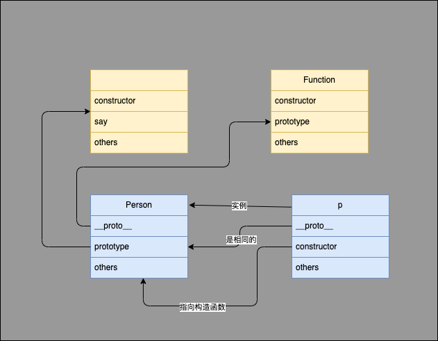

# 原型
## 为什么会有原型
在JS的设计中，为了实现代码复用和面向对象，出现了原型
原型的出现使得JS具备了更加合理的定义对象的方式，可以把公共的属性和方法放在原型上供所有实例使用

## 什么是原型
原型是一个对象，可以被其他对象继承
一般就是对象的`__proto__`属性，他指向这个对象的构造函数的原型
同时，还有另一个属性`prototype`，只有函数才有，一般会在构造函数的该属性上定义公共方法
他们之间的关系如图所示：

另外有几个特性：
- `Object.create()`方法创建一个新对象，使用现有的对象来提供新创建的对象的`__proto__`
- 所有构造器/函数的`__proto__`都指向`Function.prototype`
- 如果构造函数返回的是Object,那么new出来的就是返回值,如果返回的是基本类型,new出来的就是构造函数生成的对象

## 构造函数与 new 操作
