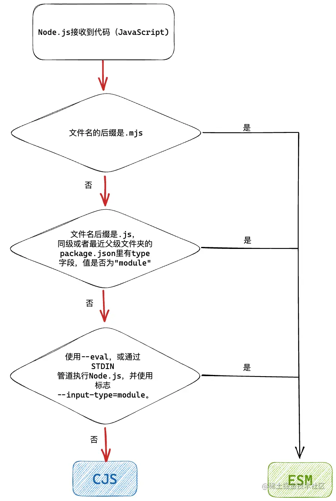
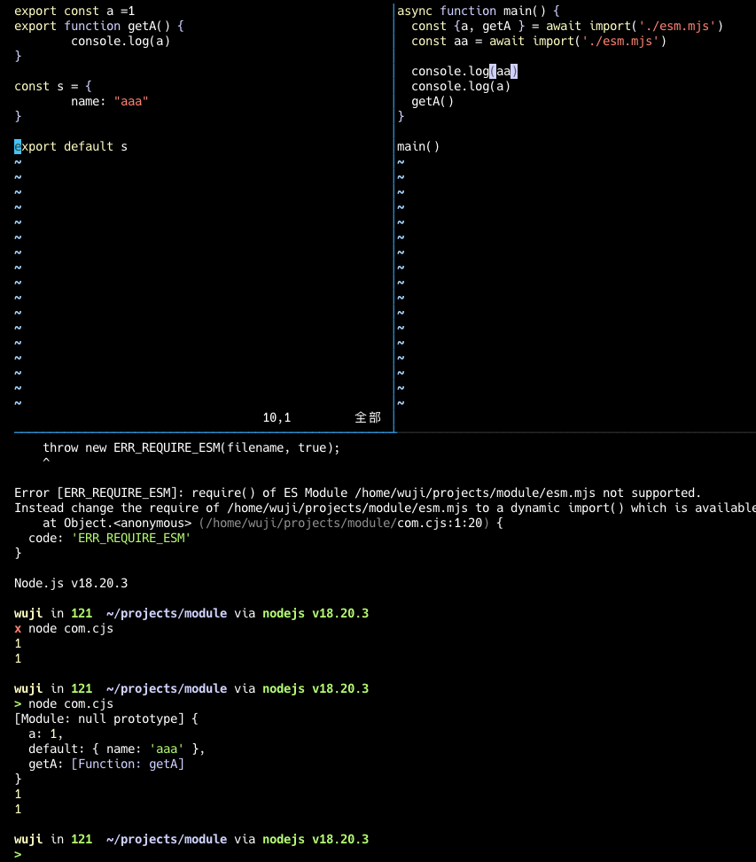
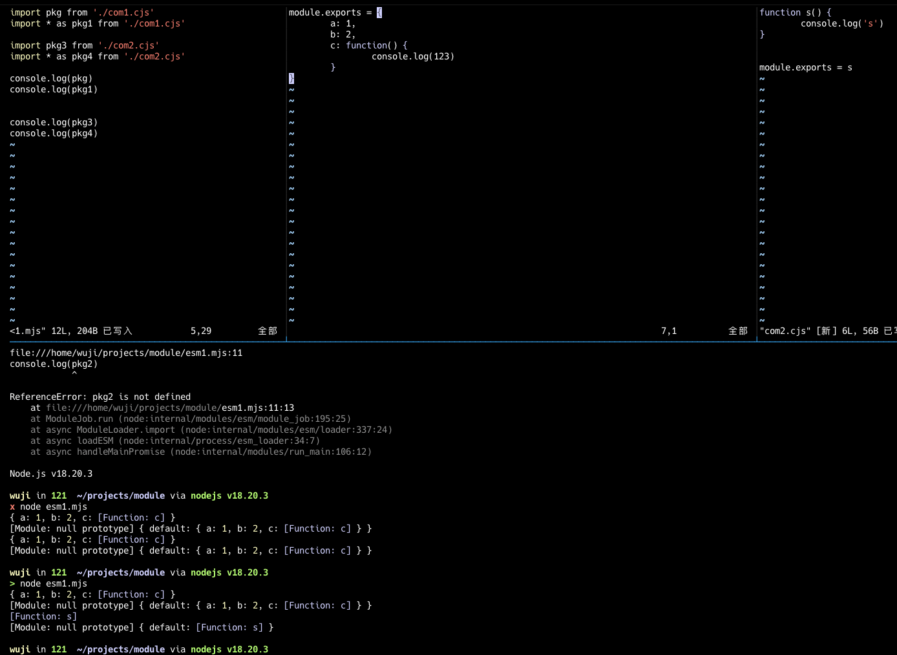

# ES 模块与 CommonJS 模块 交互
Node.js 从 v13.2.0 版本开始稳定支持 ES 模块

使用 package.json 中的 "type": "module" 字段来指定你的项目使用 ES 模块，然后使用 import() 函数动态导入 CommonJS 模块，或者使用 Babel 等工具将 CommonJS 模块转换为 ES 模块。

在 CommonJS 模块中，你需要将所有要导出的内容都添加到 module.exports 对象中。 在 ES 模块中，你可以使用 export 导出单个变量、函数或类。 如果需要在 ES 模块中使用 CommonJS 模块，则需要根据 CommonJS 模块的 module.exports 对象来访问其导出的内容。

在 CommonJS 模块中，__dirname 和 __filename 变量分别表示模块所在的目录和文件名。 在 ES 模块中，需要使用 import.meta.url 来获取模块的 URL，然后使用 url.fileURLToPath() 将其转换为文件路径。

创建 .mjs 文件 和 .cjs 文件

