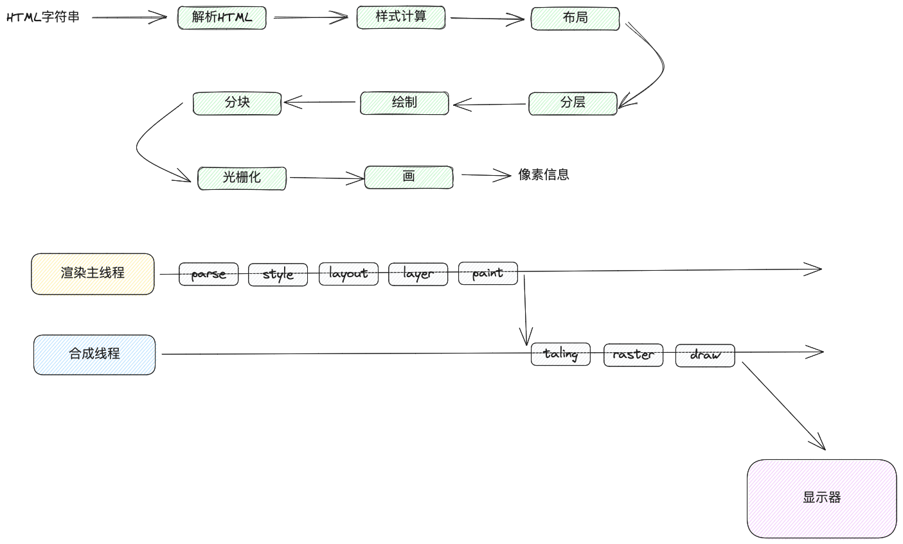
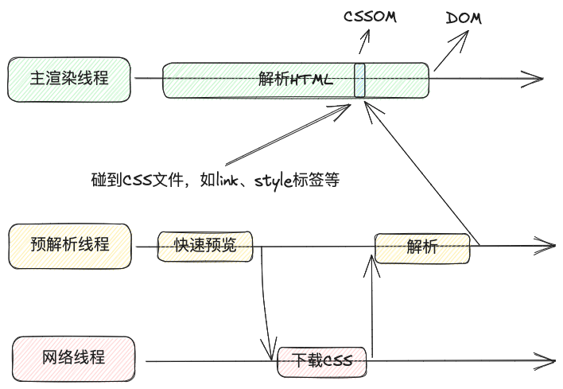

# 浏览器绘制
## 绘制过程
1. 浏览器绘制流程
   总体流程如下：
   
   浏览器会解析 DOM树 和 CSSOM树，P、div 等标签之所以有样式是因为浏览器提供了默认样式
2. CSS 处理
   在解析HTML过程中遇到CSS怎么处理呢？
   
   会有预解析线程发现css资源，需要下载的去下载，初步解析后交给主线程，再由主线程生成 CSSOM ，最后生成DOM
3. JS 处理
   同样是预解析线程发现JS资源，但是主线程碰到JS后会立即暂停染，去执行JS代码，因为JS可能会修改DOM和CSS
4. DOM 树和 CSSOM树 计算完毕后会计算每个元素的样式，组成`computed style`
   在这个过程中，会计算每个元素的CSS属性值，就是他的最终样式，包括层叠、优先级、样式继承等
5. 布局
   根据计算好样式的DOM树计算出 Layout树
   在这个过程中，会计算元素的尺寸和位置
   DOM树 和 Layout树 不一定是一一对应的，因为像伪元素、匿名行盒、匿名块盒这些元素并不在DOM树中，而是通过计算得到的，`display: none`的元素不会出现在布局树中
   像`document.body.offsetHeight`这些元素，是布局树里的信息
6. 分层
   为了提高绘制效率，浏览器会将页面分层，更新时重新计算对应层
   滚动条、层叠上下文、transform、opacity、等样式会影响分层结果，但影响度是不确定的，可以通过`will-change`更大程度的影响分层
7. 绘制
   主线层会为每个层生成绘制指令集，描述这一层怎么绘制
8. 分块
   分块会将每一层分成多个小区域
   主线程会通过合成线程，合成线程使用分块器分块
9. 光栅化
    合成线程将块信息交给GPU，生成一块块的位图
10. 画 Draw
    合成线程拿到每个层、块的位图后，生成一个个指引（quad）信息
    指引会标识每一块出现在屏幕的位置，会考虑到旋转、缩放等变形
    变形发生在合成线程，与主渲染线程无关，这就是`transform`效率高的原因
    最终合成线程把指引信息交给GPU进程（浏览器里的），再由CPU绘制在屏幕上
## 重新绘制
1. reflow
   当影响到布局的样式属性被修改时，浏览器会重新执行渲染的整个过程
   例如改变元素的尺寸、定位等
   当代码里多次改变这些样式时，为了提高效率，浏览器会合并这些操作，但是当读取布局树信息时，可能新的布局树还未生成，所以在读取布局树属性时会立即reflow获取新的属性，这就是读取某些属性会回流的原因
2. repaint
   当不会造成布局变动的样式被修改时，会重新根据分层信息计算绘制指令，然后执行绘制步骤后的操作
3. transform 效率问题
   transform 只会影响渲染流程最后的 draw 阶段，由于 draw 发生在合成线程中，因此几乎不会影响主线程
   